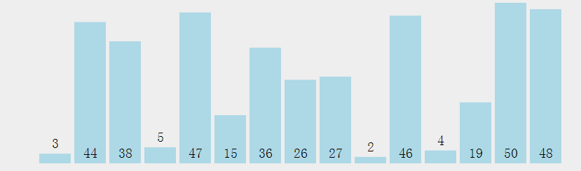
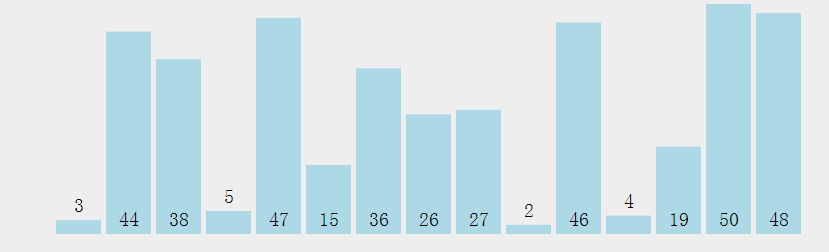
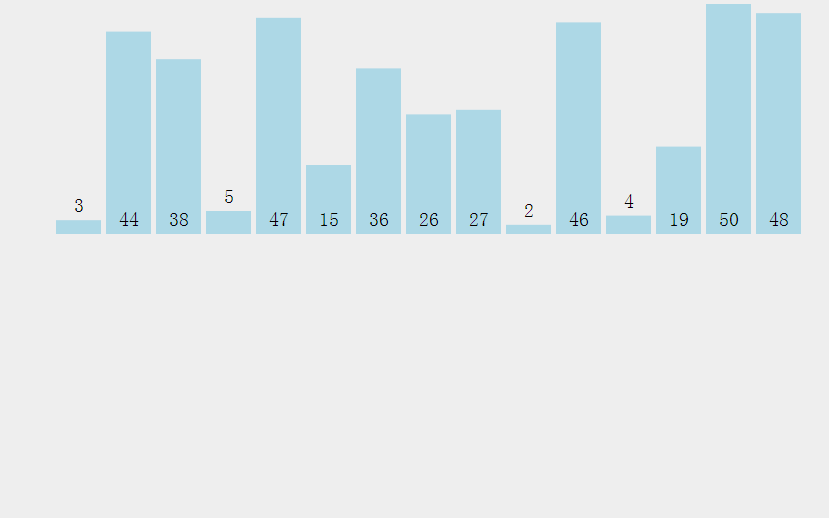
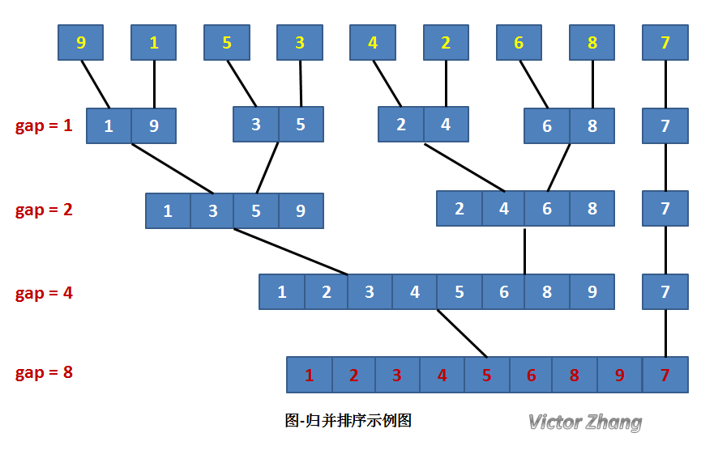
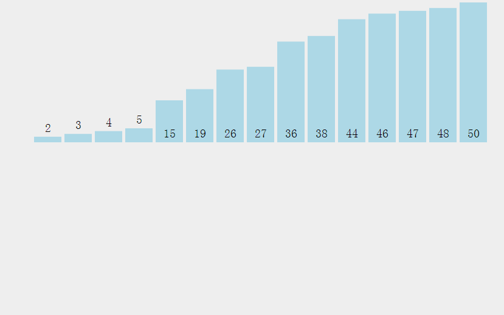
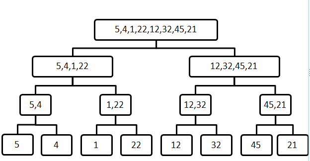
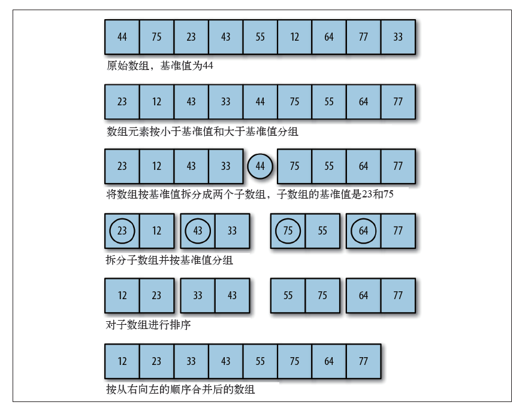

# 1 常见排序算法原理及实现

## 1.1 基本排序算法

## 1.1.1 冒泡排序

基本思想：对元素个数为 n 的待排序序列进行排序时，共进行 n-1 次循环。在第 k 次循环中，对从第一到 n-k 个元素从前往后进行比较，每次比较相邻的两个元素，若前一个元素大于后一个元素，则两者互换位置，否则保持不变。这样一次循环下来，就把第 k 大元素移动到第 n-k 个位置上，称为第 k 趟冒泡。整个过程一共进行 n-1 趟冒泡，直到第一个元素和第二个元素比较完成，最终剩余最小的元素，留在第一个位置上，排序结束。

## 1.1.2 选择排序

基本思想：在未排序的序列中选出最小的元素和序列的首位元素交换，接下来在剩下的未排序序列中再选出最小的元素与序列的第二位元素交换，以此类推，最后形成从小到大的已排序序列。

## 1.1.3 插入排序

基本思想：将待排序的一组序列分为已排好序和未排序的两个部分；初始状态时，已排序序列仅包含第一个元素，未排序序列中的元素为除第一个元素以外的 n-1 个元素；此后将未排序序列中的元素逐一插入到已排序的序列中。如此往复，经过 n-1 次插入后，未排序序列中的元素个数为 0，则排序完成。

## 1.2 高级排序算法

## 1.2.1 希尔排序（分治思想）

基本思想：把记录按步长 gap 分组，对每组记录采用直接插入排序方法进行排序。随着步长逐渐减小，所分成的组包含的记录越来越多，当步长的值减小到 1 时，整个数据合成为一组，构成一组有序记录，则完成排序。

## 1.2.2 归并排序（分治思想）

基本思想：将大小为 n 的序列看成 n 个长度为 1 的子序列，接下来将相邻子序列两两进行归并操作，形成 n/2 个长度为 2 （或为 1）的有序子序列；然后在继续进行相邻子序列两两归并操作，如此一致循环，直到剩下长度为 n 的子序列，则该序列为原序列完成排序后的序列。

## 1.2.3 快速排序（分治思想）

基本思想：将为排序元素根据基准分为两个子序列，其中一个子序列的记录均大于基准，而另一个子序列均小于基准，然后递归的对这两个子序列用类似的方法进行排序。

[常见排序算法实现源码：sort.js](./sort.js)

# 3 排序算法效率比较

|排序方法		|平均时间复杂度	|最坏时间复杂度	|额外空间复杂度	|稳定性		|
|:-----:	    |:-----:		|:-----:		|:-----:		|:-----:	|
|简单选择排序	|O(N^2)			|O(N^2)			|O(1)			|不稳定		|
|直接插入排序	|O(N^2)			|O(N^2)			|O(1)			|稳定 		|
|冒泡排序		|O(N^2)			|O(N^2)			|O(1)			|稳定 		|
|希尔排序		|O(N^d)			|O(N^2)			|O(1)			|不稳定  	|
|堆排序			|O(N*log2N)		|O(N*log2N)		|O(1)			|不稳定 	|
|快速排序		|O(N*log2N)		|O(N^2)			|O(log2N)		|不稳定 	|
|归并排序		|O(N*log2N)		|O(N*log2N)		|O(N)			|稳定 	 	|
|基数排序		|O(D(N+R))		|O(D(N+R))		|O(N+R)			|稳定 		|

注：假定在待排序的记录序列中，存在多个具有相同的关键字的记录，若经过排序，这些记录的相对次序保持不变，则称这种排序算法是稳定的；否则称为不稳定的。

# 4 排序算法的适用场景

- 基数排序：适用于处理数量大、关键字取值范围有限的序列；例如扑克牌排序

- 简单选则排序、直接插入排序、冒泡排序：适用于元素规模 N 较小或基本有序时

总之应该根据具体条件选择相应的排序方法，甚至将 2 中以上的排序方法结合使用。
