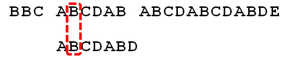
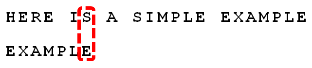
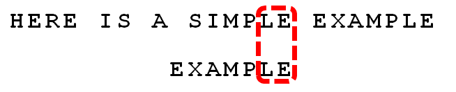
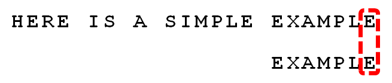

# 模式匹配算法

# 1 单模式匹配算法

## 1.1 朴素算法（Brute-Force）

### 1.1.1 算法思想

从`目标串T`的的第一个字符起与`模式串P`的第一个字符比较。若相等，则继续对字符进行后续的比较；否则目标串从第二个字符起与模式串的第一个字符重新比较。直至模式串中的每个字符依次和目标串中的一个连续的字符序列相等为止，此时称为匹配成功，否则匹配失败。

### 1.1.2 图解算法


### 1.1.3 代码实现

[字符串搜索算法-朴素算法（Brute-Force）源码](./1.1-brute-force.js)

## 1.2 Rabin–Karp 算法（RK）

### 1.2.1 算法思想

将模式串P的hash值跟目标串T中的每一个长度为|P|的子串的hash值比较。如果不同，则它们肯定不相等；如果哈希值相同，那么字符串有可能相同（哈希冲突），则再诸位比较之。

### 1.2.2 图解算法


### 1.2.3 代码实现

[字符串搜索算法-Rabin–Karp 算法（RK）源码](./1.2-rabin-karp.js)

## 1.3 Knuth-Morris-Pratt 算法（KMP）

### 1.3.1 算法思想

#### 1.3.1.1 图解基于部分匹配表（Partial Match Table）的 KMP 算法

下面以在目标串 "BBC ABCDAB ABCDABCDABDE" 中匹配模式串 "ABCDABD" 为例简单理解下 KMP 算法：

- 1、目标串 "BBC ABCDAB ABCDABCDABDE" 的第一个字符与模式串 "ABCDABD" 的第一个字符，进行比较。


- 2、因为 `B` 与 `A` 不匹配，所以将目标串后移一位继续匹配模式串。


- 3、就这样一位一位的进行匹配，直到目标串和模式串开始匹配为止。


- 4、当目标串和模式串开始匹配后，继续向后匹配（匹配的越多越好）



- 5、直到目标串和模式串对应的字符不相同为止


这时，最自然的反应是，将目标串整个后移一位，再从头逐个比较。这样做虽然可行，但是效率很差，因为你要把"搜索位置"移到已经比较过的位置，重比一遍


一个基本事实是，当空格与`D`不匹配时，你其实知道前面六个字符 "ABCDAB" 是匹配的。KMP算法的想法是，设法利用这个已知信息，不要把"搜索位置"移回已经比较过的位置，继续把它向后移，这样就提高了效率

怎么做到这一点呢？可以针对模式串，算出一张《部分匹配表》（Partial Match Table）。这张表是如何产生的，后面再介绍，这里只要会用就可以了


- 6、已知空格与`D`不匹配时，前面六个字符"ABCDAB"是匹配的。查表可知，最后一个匹配字符`B`对应的"部分匹配值"为2，因此按照下面的公式算出向后移动的位数：

```
移动位数 = 已匹配的字符数 - 对应的部分匹配值
```

即：6 - 2 = 4，所以将目标串向后移动4位，继续比较（跳过公共最长前后缀，直接比较失配位）


- 7、因为空格与`Ｃ`不匹配，搜索词还要继续往后移。这时，已匹配的字符数为2（"AB"），对应的"部分匹配值"为0。所以，移动位数 = 2 - 0，结果为 2，于是将搜索词向后移2位


- 8、因为空格与 `A` 不匹配，继续后移一位


- 9、逐位比较，直到发现 `C` 与 `D` 不匹配。于是，移动位数 = 6 - 2，继续将搜索词向后移动4位


- 10、逐位比较，直到模式串的最后一位，发现完全匹配，于是匹配完成。如果还要继续匹配（即找出全部匹配），移动位数 = 7 - 0，再将模式串向后移动7位，这里就不再重复了


#### 1.3.1.2 如何构造部分匹配表？

如果给定的模式串是：“ABCDABD”，从左至右遍历整个模式串，其各个子串的前缀后缀分别如下表格所示：


也就是说，原模式串子串对应的各个前缀后缀的公共元素的最大长度表为


#### 1.3.1.3 为什么要构造部分匹配表？

假设在我们的匹配过程中出现了这一种情况：（上面是目标串下面是模式串）


蓝色部分表示匹配成功，红色部分表示匹配失败

我们取之前已经匹配的部分（即蓝色的那部分！）


于是在上面说到部分匹配表中记录的“最长公共前后缀”，体现到图中就是这个样子！


接下来，就是最重要的移动了！


模式串移动最长公共前后缀长度，从而在失配位重新匹配，而且还避免匹配串从头开始！如下图所示！（这就是精髓所在）


（重新匹配刚才的失配位！）

用图来描述已经很清楚了，不知道聪明的你看明白了吗？如果说成这样你都不明白，那么你真的得重新理解什么是 KMP 算法了！

### 1.3.2 代码实现

[字符串搜索算法-Knuth-Morris-Pratt 算法（KMP）源码](./1.3-knuth-morris-pratt.js)

>参考博文：
>
>[阮一峰：字符串匹配的KMP算法](http://www.ruanyifeng.com/blog/2013/05/Knuth%E2%80%93Morris%E2%80%93Pratt_algorithm.html)
>
>[jake_boxer: The Knuth-Morris-Pratt Algorithm in my own words](http://jakeboxer.com/blog/2009/12/13/the-knuth-morris-pratt-algorithm-in-my-own-words/)
>
>[c_cloud: KMP，深入讲解next数组的求解](http://www.cnblogs.com/c-cloud/p/3224788.html)
>
>[July: 从头到尾彻底理解KMP](http://blog.csdn.net/v_july_v/article/details/7041827)
>
>[MandW: 如果你看不懂KMP算法，那就看一看这篇文章( 绝对原创，绝对通俗易懂)](http://blog.csdn.net/u011564456/article/details/20862555)

注：详细 KMP 算法讲解，请参考 [July：从头到尾彻底理解KMP](http://blog.csdn.net/v_july_v/article/details/7041827)

## 1.4 Boyer-Moore 算法（BM）

### 1.4.1 算法思想

我们知道常规的字符串匹配算法是从左往右的，这也比较符合我们一贯的思维，但是 BM 算法是从右往左的。

常规的字符串匹配算法每当失匹的时候，模式串就会往后移一位，和目标串继续匹配；而 BM 算法所做的就是改进这一步操作，即模式串不在每次只移动一步，而是根据已经匹配的后缀信息，来判断移动的距离，通常80%左右能够移动模式串的长度，从而可以跳过大量不必须比较的字符，大大提高了查找效率。

为了实现更快的移动模式串，BM 定义了两个规则，`坏字符规则`和`好后缀规则`。这两个规则分别计算我们能够向后移动模式串长度，然后选取这两个规则中移动大的，作为我们真正移动的距离。

假定字符串为 `HERE IS A SIMPLE EXAMPLE`，模式串为 `EXAMPLE`。



上图中我们看到，`S` 与 `E` 不匹配。这时，`S` 就被称为 `坏字符（bad character）`，即不匹配的字符。


上图中 `MPLE` 与 `MPLE` 匹配。我们把这种情况称为 `好后缀（good suffix）`，即所有尾部匹配的字符串。注意，`MPLE`、`PLE`、`LE`、`E`都是好后缀，这点后面我们会用到。

#### 1.4.1.1 坏字符算法

当出现一个坏字符时, BM 算法向右移动模式串, 让模式串中最靠右的对应字符与坏字符相对，然后继续匹配。

**坏字符算法有两种情况：**

- 1、模式串中有对应的坏字符时，如下图：（y 为目标串，x 为模式串）


让模式串中最靠右的对应字符与目标串中的坏字符相对

- 2、模式串中不存在坏字符，如下图：


直接右移整个模式串长度

#### 1.4.1.2 好后缀算法

**好后缀算法分为三种情况：**

1、模式串中有子串和好后缀完全匹配，如下图：


此时移动模式串，让该子串和好后缀对齐即可，如果超过一个子串匹配上好后缀，则选择最靠右边的子串对齐，防止有漏匹配的。

2、如果不存在和好后缀完全匹配的子串，则在好后缀中找到具有如下特征的最长子串,使得P[m-s…m] = P[0…s]，如下图：


3、如果完全不存在和好后缀匹配的子串，则右移整个模式串。如下图：


### 1.4.2 实例分析

1、假定字符串为 `HERE IS A SIMPLE EXAMPLE`，搜索词为 `EXAMPLE`。如下图：


2、首先，"字符串"与"搜索词"头部对齐，从尾部开始比较。如下图：


这是一个很聪明的想法，因为如果尾部字符不匹配，那么只要一次比较，就可以知道前7个字符（整体上）肯定不是要找的结果。

3、我们看到，"S" 与 "E" 不匹配。这时，"S" 就被称为 "坏字符"（bad character），即不匹配的字符。我们还发现，"S" 不包含在搜索词 "EXAMPLE" 之中，这意味着可以把搜索词直接移到 "S" 的后一位。如下图：


4、依然从尾部开始比较，发现 "P" 与 "E" 不匹配，所以 "P" 是 "坏字符"。但是，"P" 包含在搜索词 "EXAMPLE" 之中。所以，将搜索词后移两位，两个 "P" 对齐。如下图：


我们由此总结出 "坏字符规则"：

```
后移位数 = 坏字符的位置 - 模式串中最靠右出现位置
```

如果"坏字符"不包含在搜索词之中，则上一次出现位置为 -1。

以 "P" 为例，它作为"坏字符"，出现在模式串的第6位（从0开始编号），在模式串中最靠右出现位置为4，所以后移 `6 - 4 = 2` 位。再以前面第二步的 "S" 为例，它出现在第 6 位，上一次出现位置是 -1（即未出现），则整个目标串后移 `6 - (-1) = 7` 位。

5、依然从尾部开始比较，"E" 与 "E" 匹配。如下图：


6、比较前面一位，"LE" 与 "LE" 匹配。如下图：



7、比较前面一位，"PLE" 与 "PLE" 匹配。如下图：


8、比较前面一位， "MPLE" 与 "MPLE" 匹配。如下图：


我们把这种情况称为 "好后缀"（good suffix），即所有尾部匹配的字符串。注意，"MPLE"、"PLE"、"LE"、"E" 都是好后缀。

9、比较前一位，发现 "I" 与 "A" 不匹配。所以，"I" 是"坏字符"。如下图：


10、根据"坏字符规则"，此时搜索词应该后移 `2 - （-1）= 3` 位。如下图：

问题是，此时有没有更好的移法？


11、我们知道，此时存在"好后缀"。所以，可以采用"好后缀规则"：


```
后移位数 = 好后缀的位置 - 目标串中最靠右出现的位置
```

具体参考前面提到的"好后缀算法"。

根据"好后缀规则"移动之后如下图：


可以看到，此时"坏字符规则"只能移3位，"好后缀规则"可以移6位。所以，Boyer-Moore 算法的基本思想是，每次后移这两个规则之中的较大值。

更巧妙的是，这两个规则的移动位数，只与搜索词有关，与原字符串无关。因此，可以预先计算生成《坏字符规则表》和《好后缀规则表》。使用时，只要查表比较一下就可以了。

12、继续从尾部开始比较，"P" 与 "E" 不匹配，因此 "P" 是"坏字符"。如下图：


13、根据"坏字符规则"，后移 `6 - 4 = 2` 位。从尾部开始逐位比较，发现全部匹配，于是搜索结束。如果还要继续查找（即找出全部匹配），则根据"好后缀规则"，后移 `6 - 0 = 6`位，即头部的 "E" 移到尾部的 "E" 的位置。如下图：



### 1.4.3 算法详解

根据实例分析我们知道，首先要构造《坏字符规则表》和《好后缀规则表》。

#### 1.4.3.1 构造《坏字符规则表》

这个计算应该很容易，似乎只需要 `BC[i] = m – 1 – i` 就行了，但这样是不对的，因为 i 位置处的字符可能在 pattern 中多处出现（如下图所示），而我们需要的是最右边的位置，这样就需要每次循环判断了，非常麻烦，性能差。这里有个小技巧，就是使用字符作为下标而不是位置数字作为下标。这样只需要遍历一遍即可，这貌似是空间换时间的做法。


如前所述，BC[] 的计算分两种情况，与前一一对应。

- 字符在模式串中有出现，`BC['v']` 表示字符 v 在模式串中最后一次出现的位置，距离模式串串尾的长度，如上图所示。

- 字符在模式串中没有出现，如模式串中没有字符 v，则 `BC['v'] = pattern.length`。

写成代码也非常简单：

```javascript
/**
 * 字符串搜索算法-boyer-moore 算法之构建《坏字符规则表》算法
 * @param {string} pattern 模式串
 * @author  Aidan aidandai@126.com
 */
function preBC(pattern){
	var objBC = {},
		len = pattern.length;

	for(let i=0, n=len-1; i<n; i+=1){
       objBC[String(pattern.charCodeAt(i))] = len - 1 - i;
    }

	return objBC;
}
```

计算 pattern 需要右移的距离，要借助 BC 数组，那么 BC 的值是不是就是 pattern 实际要右移的距离呢？No，想想也不是，比如前面举例说到利用 BC 算法还可能走回头路，也就是右移的距离是负数，而 BC 的值绝对不可能是负数，所以两者不相等。那么 pattern 实际右移的距离怎么算呢？这个就要看目标串中坏字符的位置了，前面说过坏字符算法是针对目标串的，还是看图吧，一目了然。图中 `v` 是目标串中的坏字符（对应位置i+j）,在 pattern 中对应不匹配的位置为 i，那么 pattern 实际要右移的距离就是：offset = BC['v'] – m + 1 + i。


#### 1.4.3.1 构造《好后缀规则表》

如前所述，GS[] 数组的计算分三种情况，与前一一对应。假设图中好后缀长度用数组 suff[] 表示。

1、对应好后缀算法第一种情况，如下图，j是好后缀之前的那个位置。


2、对应好后缀算法第二种情况，如下图所示：


3、对应好后缀算法第三种情况，`GS[i] = pattern.length = m` 如下图所示：


这样就更加清晰了，代码编写也比较简单：

```javascript
/**
 * 字符串搜索算法-boyer-moore 算法之构建《好后缀规则表》算法
 * @param {string} pattern 模式串
 * @author  Aidan aidandai@126.com
 */
function preGS(pattern){
    var arrGS = [],
    	arrSuff = suffix(pattern), // 计算后缀数组
    	len = pattern.length;

    // 先全部赋值为 len，包含第三种情况
    for(let i=0; i<len; i+=1){
        arrGS[i] = len;
    }

    // 处理第二种情况
    for(let i=len-1; i>=0; i-=1){
        if(arrSuff[i] === i+1){
            for(let j=0; j<len-1-i; j+=1){
                if(arrGS[j] === len){
                    arrGS[j] = len - 1 - i;
                }
            }
        }
    }

    // 处理第三种情况
    for(let i=0; i<=len-2; i+=1){
        arrGS[len-1-arrSuff[i]] = len - 1 - i;
    }

    return arrGS;
}
```

So easy? 结束了吗？还差一步呢，这里的 suff[] 咋求呢？

在计算 GS[] 数组时，为提高效率，先计算辅助数组 suff[] 表示好后缀的长度。

实际上 suff[i] 就是求 pattern 中以 i 位置字符为后缀和以最后一个字符为后缀的公共后缀串的长度。不知道这样说清楚了没有，还是举个例子吧：

```
i      : 0 1 2 3 4 5 6 7
pattern: b c a b a b a b
```

当 i = 7 时，按定义 suff[7] = pattern.length = 8

当 i = 6 时，以 pattern[6] 为后缀的后缀串为 bcababa ，以最后一个字符 b 为后缀的后缀串为 bcababab ，两者没有公共后缀串，所以 suff[6] = 0。

当 i = 5 时，以 pattern[5] 为后缀的后缀串为 bcabab ，以最后一个字符 b 为后缀的后缀串为 bcababab ，两者的公共后缀串为 abab ，所以 suff[5] = 4。

以此类推……

当 i = 0 时，以 pattern[0] 为后缀的后缀串为 b ，以最后一个字符 b 为后缀的后缀串为 bcababab ，两者的公共后缀串为 b，所以 suff[0] = 1。

这样看来代码也很好写：

```javascript
/**
 * 字符串搜索算法-boyer-moore 算法之生成好后缀算法
 * @param {string} pattern 模式串
 * @author  Aidan aidandai@126.com
 */
function suffix(pattern){
	var arrSuff = [],
		len = pattern.length;

    arrSuff[len-1] = len;

    for(let i=len-2; i>=0; i-=1){
        let j = i;
        while(j>=0 && pattern[j]===pattern[len-1-i+j]){
        	j -= 1;
        }
        arrSuff[i] = i - j;
    }

    return arrSuff;
}
```

这样可能就万事大吉了，可是总有人对这个算法不满意，感觉太暴力了，于是有聪明人想出一种方法，对上述常规方法进行改进。基本的扫描都是从右向左，改进的地方就是利用了已经计算得到的 suff[] 值，计算现在正在计算的 suff[] 值。具体怎么利用，看下图：

i 是当前正准备计算 suff[] 值的那个位置。

f 是上一个成功进行匹配的起始位置（不是每个位置都能进行成功匹配的，实际上能够进行成功匹配的位置并不多）。

g 是上一次进行成功匹配的失配位置。

如果 i 在 g 和 f 之间，那么一定有 P[i] = P[len-1-f+i]；并且如果 suff[len-1-f+i] < i-g, 则 suff[i] = suff[len-1-f+i]，这不就利用了前面的 suff 了嘛。


PS：这里有些人可能觉得应该是 suff[len-1-f+i] <= i–g，因为若suff[len-1-f+i] = i–g，还是没超过 suff[f] 的范围，依然可以利用前面的 suff[] ，但这是错误的，比如一个极端的例子：

```
i      ：0 1 2 3 4 5 6 7 8 9
pattern：a a a a a b a a a a
```

suff[4] = 4，这里 f = 4，g = 0，当 i = 3 是，这时 suff[len-1-f+i] = suff[8]=3，而 suff[3] = 4，两者不相等，因为上一次的失配位置 g 可能会在这次得到匹配。

好了，这样解释过后，代码也比较简单：

```javascript
/**
 * 字符串搜索算法-boyer-moore 算法之生成好后缀优化算法
 * @param {string} pattern 模式串
 * @author  Aidan aidandai@126.com
 */
function suffix(pattern){
	var arrSuff = [],
		len = pattern.length,
		g = len - 1,
		f = len - 1;

    arrSuff[len-1] = len;
    for (let i=len-2; i>=0; i-=1) {
        if (i > g && arrSuff[len-1-f+i] < i-g){
      		arrSuff[i] = arrSuff[len-1-f+i];
        }else{
         	if (i < g){
         	    g = i;
         	}
         	f = i;
         	while (g>=0 && pattern[g]===pattern[len-1-f+g]){
            	g -= 1;
         	}

         	arrSuff[i] = f - g;
        }
    }

    return arrSuff;
}
```

结束了？OK，可以说重要的算法都完成了，希望大家能够看懂，为了验证大家到底有没有完全看明白，下面出个简单的例子，大家算一下 BC[] 、 suff[] 和 GS[] 吧。


PS：这里也许有人会问：BC['b'] 怎么等于2，它不是最后出现在 pattern 最后一个位置吗？按定义应该是 0 啊。请大家仔细看下 BC 的算法：

```javascript
for(let i=0, n=len-1; i<n; i+=1){
    objBC[pattern[i]] = len - 1 - i;
}
```

这里是 i<len–1不是 i<len ，也就是最后一个字符如果没有在前面出现过，那么它的 BC 值为 len。为什么最后一位不计算在 BC 中呢？很容易想啊，如果记在内该字符的 BC 就是0，按前所述，pattern需要右移的距离：`offset = BC['v']-len+1+i` = -len+1+i <= 0，也就是原地不动或走回头路，当然不干了，前面这种情况已经说的很清楚了，所以这里是 m-1。

### 1.4.4 代码实现

[字符串搜索算法- BM 算法源码](./1.4-boyer-moore.js)

>参考博文：
>
>[阮一峰：字符串匹配的Boyer-Moore算法](http://www.ruanyifeng.com/blog/2013/05/boyer-moore_string_search_algorithm.html)
>
>[敏敏Alexia: grep之字符串搜索算法Boyer-Moore由浅入深（比KMP快3-5倍）](http://blog.jobbole.com/52830/)
>
>[appleprince88: Boyer-Moore算法](http://blog.csdn.net/appleprince88/article/details/11881323)

## 1.5 Boyer-Moore-Horspool 算法（BMH）

Boyer-Moore-Horspool 算法也称 Horspool 算法，由 Nigel Horspool 设计于1980年，是在 BM 算法上改进版，因为 BM 算法里面的 好后缀规则较难理解，同时其效率与正确性的证明当时一直没有得到解决，所以 Horspool  算法只用了一个 BM 里的坏字符规则。

借用 "find a needle in a haystack" 典故，意为"大海捞针"，引意到我们这里就是 从 haystack 字串中查找 needle 字串（haystack 串等同于 target 串，needle 串等同于 pattern 串）。

### 1.5.1 算法思想

Horspool 算法 也是从右向左比较，但 Horspool 算法相对于 Boyer-Moore 算法改进了坏字符规则；从右向左匹配，当遇到不匹配字符 (mismatch character) 时:

BM 跳转规则: `当前不匹配字符`和 `needle 中最右边出现的该字符`对齐匹配;

Horspool 跳转规则：`haystack 串中与 needle 串尾部字符对应的字符`和 `needle 串中最右边出现的该字符`对齐匹配;

总之：horspool 算法将目标串中匹配窗口的最后一个字符跟模式串中的最后一个字符比较。如果相等，继续从后向前对主串和模式串进行比较，直到完全相等或者在某个字符处不匹配为止（如下图中的α与σ失配） 。如果不匹配，则根据主串匹配窗口中的最后一个字符β在模式串中最右边出现位置将窗口向右移动。


>参考博文：
>
>[CobbLiu：串的模式匹配算法---Horspool](http://www.cnblogs.com/cobbliu/archive/2012/05/29/2524244.html)
>
>[famince: 字符串匹配算法之Boyer-Moore-Horspool Algorithm](https://my.oschina.net/amince/blog/180497)

## 1.6 Sunday 算法

Sunday 算法由 Daniel M.Sunday 在 1990 年提出，它的思想跟 BM 算法很相似：

只不过 Sunday 算法是从前往后匹配，在匹配失败时关注的是目标串中参加匹配的最末位字符的下一位字符。

`如果该字符没有在模式串中出现则直接跳过，即移动位数 = 目标串长度 + 1；否则，其移动位数 = 模式串中最右端的该字符到模式串末尾的距离 + 1。`

# 1 多模式匹配算法