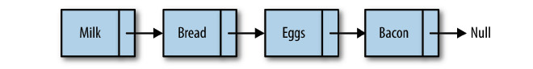
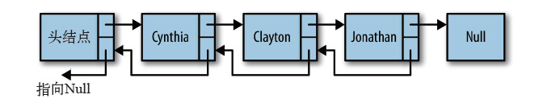
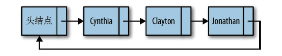

# 链表（linkedList）

“链表”（linkedList）是由一组节点组成的集合。每个节点都使用一个对象的引用指向它的后继。指向另一个节点的引用叫做链。

队列的抽象数据类型定义：

**数据名称：**链表（linkedList）

**数据对象集：**一组节点组成的集合。

**操作集：**

|名称|性质|含义|
|:-----|:------|:------|
|head|属性|头节点|
|find|方法|查找给定值|
|insert|方法|插入节点|
|remove|方法|删除节点|
|display|方法|返回链表的字符串形式|

## 双向链表（doublyLinkedList）

**操作集：**

|名称|性质|含义|
|:-----|:------|:------|
|head|属性|头节点|
|find|方法|查找给定值|
|findLast|方法|返回最后一个节点|
|insert|方法|插入节点|
|remove|方法|删除节点|
|display|方法|返回链表的字符串形式|
|displayReverse|方法|返回翻转链表的字符串形式|

## 循环链表（circularLinkedList）

**操作集：**

|名称|性质|含义|
|:-----|:------|:------|
|head|属性|头节点|
|find|方法|查找给定值|
|insert|方法|插入节点|
|remove|方法|删除节点|
|display|方法|返回链表的字符串形式|