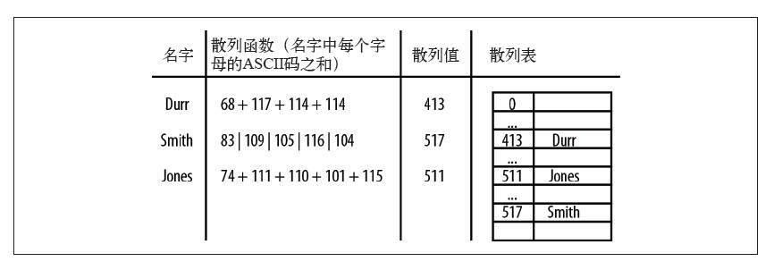
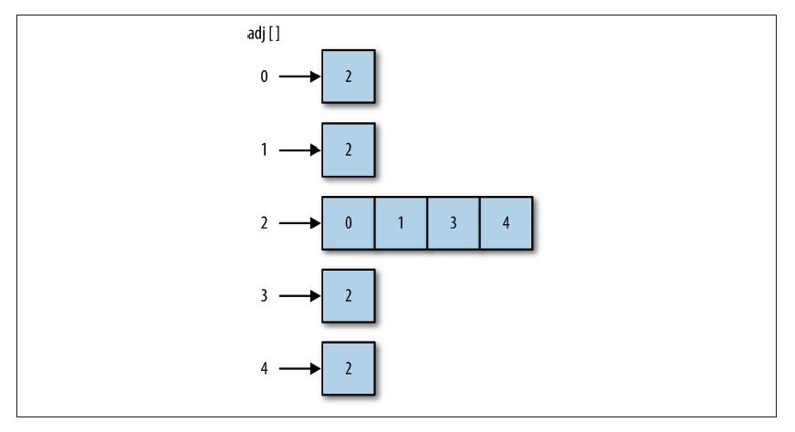

# 散列表（Symboltable）

## 1 定义

**操作集：**

|名称|性质|含义|
|:-----|:------|:------|
|hash|方法|返回哈希值|

|名称|性质|含义|
|:-----|:------|:------|
|put|方法|散列表存入元素|
|get|方法|获得散列表元素|

|名称|性质|含义|
|:-----|:------|:------|
|display|方法|显示散列表所有元素|
|count|方法|返回散列表有效元素个数|

## 2 碰撞处理

## 2.1 开链法

## 2.2 线性探测法