# 树（tree）

## 1.1 定义

树（Tree）是 n (n>=0)个结点的有限集。当n=0时成为空树，在任意一棵非空树中：

- 有且仅有一个特定的称为根（Root）的结点；

- 当 n>1 时，其余结点可分为 m（m>0）个互不相交的有限集 T1、T2、…、Tm，其中每一个集合本身又是一棵树，并且称为根的子树（SubTree）。


虽然从概念上很容易理解树，但是有两点还是需要大家注意下：

- n>0时，根结点是唯一的，坚决不可能存在多个根结点。

- m>0时，子树的个数是没有限制的，但它们互相是一定不会相交的。

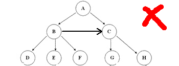

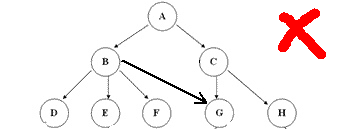

## 1.2 结点分类

刚才所有图片中，每一个圈圈我们就称为树的一个结点。

结点拥有的子树数称为结点的度-(Degree)，树的度取树内各结点的度的最大值。
 
度为0的结点称为叶结点(Leaf)或终端结点；

度不为0的结点称为分支结点或非终端结点，除根结点外，分支结点也称为内部结点。

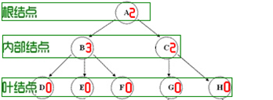

## 1.3 结点间的关系
 
结点的子树的根称为结点的孩子(Child)，相应的，该结点称为孩子的双亲(Parent)，同一双亲的孩子之间互称为兄弟(Sibling)。

结点的祖先是从根到该结点所经分支上的所有结点。

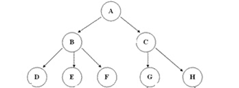

## 1.4 结点的层次
 
结点的层次(Level)从根开始定一起，根为第一层，根的孩子为第二层。

其双亲在同一层的结点互为堂兄弟。
 
树中结点的最大层次称为树的深度(Depth)或高度

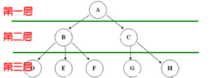

## 1.5 其他概念
 
如果将树中结点的各子树看成从左至右是有次序的，不能互换的，则称该树为有序树，否则称为无序树。

森林(Forest)是 m(m>=0)棵互不相交的树的集合。对树中每个结点而言，其子树的集合即为森林。

# 2 树的存储结构

说到存储结构，就会想到顺序存储和链式存储两种基本结构。
对于线性表来说，很直观就可以理解，但对于树这种一对多的结构，我们应该怎么办呢？
 
要存储树，简单的顺序存储结构和链式存储结构是不能滴！不过如果充分利用它们各自的特点，完全可以间接地来实现。
 
当然要考虑到双亲、孩子、兄弟之间的关系。常见的有三种不同的表示方法：双亲表示法、孩子表示法、孩子兄弟表示法。

## 2.1 双亲表示法

双亲表示法，言外之意就是以双亲作为索引的关键词的一种存储方式。
我们假设以一组连续空间存储树的结点，同时在每个结点中，附设一个指示其双亲结点在数组中位置的元素。
 
也就是说，每个结点除了知道自己是谁之外，还知道它的粑粑妈妈在哪里。
那么我们可以做如下定义：

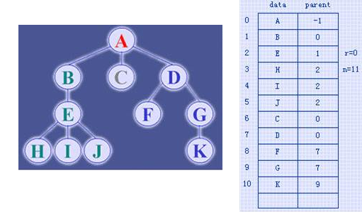

这样的存储结构，我们可以根据某结点的parent指针找到它的双亲结点，所用的时间复杂度是O(1)，索引到parent的值为-1时，表示找到了树结点的根。

可是，如果我们要知道某结点的孩子是什么？那么不好意思，请遍历整个树结构。

我们只需要稍微改变一下结构即可：


那现在我们又比较关心它们兄弟之间的关系呢？


存储结构的设计是一个非常灵活的过程，只要你愿意，你可以设计出任何你想要的奇葩！

一个存储结构设计得是否合理，取决于基于该存储结构的运算是否适合、是否方便，时间复杂度好不好等等。

## 2.2 孩子表示法

我们这次换个角度来考虑，由于树中每个结点可能有多棵子树，可以考虑用多重链表来实现。
就像我们虽然有计划生育，但我们还是无法确保每个家庭只养育一个孩子的冲动，那么对于子树的不确定性也是如此。

如果我们用“孩子表示法”，有多少种可行方案？


- 方案一：根据树的度，声明足够空间存放子树指针的结点。


缺点十分明显，就是造成了浪费！

- 方案二（改进方案一）


这样我们就克服了浪费这个概念，我们从此走上了节俭的社会主义道路！但每个结点的度的值不同，初始化和维护起来难度巨大吧？

- 方案三


那只找到孩子找不到双亲貌似还不够完善，那么我们合并上一讲的双亲孩子表示法：


## 2.3 孩子兄弟表示法 

在存储结点信息的同时，附加两个分别指向该结点最左孩子和右邻兄弟的指针域leftmostchild和rightsibling，即可得树的孩子兄弟链表表示。

下面这棵树如何用孩子兄弟表示法表示呢？


根据孩子兄弟表示法定义可以得到：


# 3 二叉树

## 3.1 二叉树的递归定义

二叉树(BinaryTree)是n(n≥0)个结点的有限集，它或者是空集(n=0)，或者由一个根结点及两棵互不相交的、分别称作这个根的左子树和右子树的二叉树组成。

## 3.2 二叉树的五种基本形态

二叉树可以是空集；根可以有空的左子树或右子树；或者左、右子树皆为空。

二叉树的五种基本形态如下图所示。

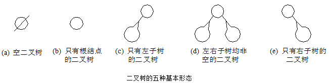

## 3.3 二叉树不是树的特例 

（1）二叉树与无序树不同

二叉树中，`每个结点最多只能有两棵子树`，并且`有左右之分`。

`二叉树并非是树的特殊情形`，它们是两种不同的数据结构。 

（2）二叉树与度数为2的有序树不同

在有序树中，虽然一个结点的孩子之间是有左右次序的，但是若该结点只有一个孩子，就无须区分其左右次序。而在二叉树中，即使是一个孩子也有左右之分。

## 3.4 二叉树的性质

- 二叉树第i层上的结点数目最多为2<sub>i-1</sub>(i≥1)

- 深度为k的二叉树至多有2<sub>k</sub>-1个结点(k≥1)

-  在任意-棵二叉树中，若终端结点的个数为n0，度为2的结点数为n2，则no=n2+1。

## 3.5 满二叉树和完全二叉树

1、满二叉树(FullBinaryTree) 

一棵深度为k且有2k-1个结点的二又树称为满二叉树。

- 满二叉树的特点：

（1）每一层上的结点数都达到最大值。即对给定的高度，它是具有最多结点数的二叉树。

（2）满二叉树中不存在度数为1的结点，每个分支结点均有两棵高度相同的子树，且树叶都在最下一层上。

2、完全二叉树(Complete BinaryTree) 

若一棵二叉树至多只有最下面的两层上结点的度数可以小于2，并且最下一层上的结点都集中在该层最左边的若干位置上，则此二叉树称为完全二叉树。

完全二叉树的特点：

（1）满二叉树是完全二叉树，完全二叉树不一定是满二叉树。

（2）在满二叉树的最下一层上，从最右边开始连续删去若干结点后得到的二叉树仍然是一棵完全二叉树。

（3）在完全二叉树中，若某个结点没有左孩子，则它一定没有右孩子，即该结点必是叶结点。

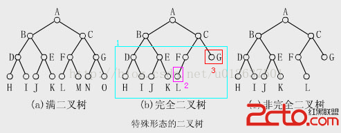

## 3.6 二叉树的存储结构

1、二叉树的顺序存储结构

在一棵n个结点的完全二叉树中，从树根起，自上层到下层，每层从左至右，给所有结点编号，能得到一个反映整个二叉树结构的线性序列。


这下看出完全二叉树的优越性来了吧？由于他的严格定义，在数组直接能表现出逻辑结构。

当然对于一般的二叉树，尽管层序编号不能反映逻辑关系，但是也可以按照完全二叉树编号方式修改一下，把不存在的结点用“^”代替即可（虚拟节点）。


但是考虑到一种极端的情况，回顾一下斜树，如果是一个又斜树，那么会变成这样。。。。。。


2、二叉链表

既然顺序存储方式的适用性不强，那么我们就要考虑链式存储结构啦。二叉树的存储按照国际惯例来说一般也是采用链式存储结构的。

二叉树每个结点最多有两个孩子，所以为它设计一个数据域和两个指针域是比较自然的想法，我们称这样的链表叫做二叉链表。


## 3.7 二叉树的遍历

### 3.7.1 中序遍历

代码：

```javascript
inOrder(node){
	if(node != null){
		this.inOrder(node.left);
		console.log(node.show());
		this.inOrder(node.right);
	}
}
```

访问路径：

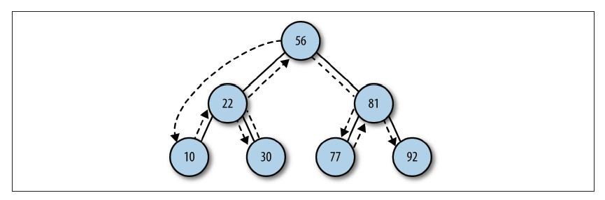

### 3.7.2 先序遍历

代码：

```javascript
preOrder(node){
	if(node != null){
		console.log(node.show());
		this.preOrder(node.left);
		this.preOrder(node.right);
	}
}
```

访问路径：

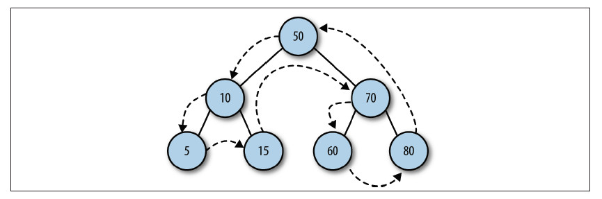

### 3.7.2 后序遍历

代码：

```javascript
postOrder(node){
	if(node != null){
		this.preOrder(node.left);
		this.preOrder(node.right);
		console.log(node.show());
	}
}
```

访问路径：

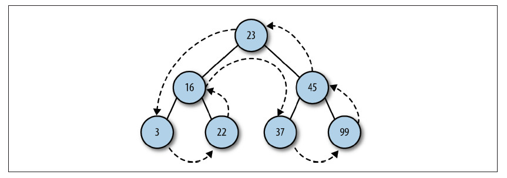

注：只要你对理解中断程序、子程序很容易理解二叉树的遍历

## 3.8 二叉树查找

### 3.8.1 查找最小值

```javascript
getBSTMin(){
	let current = this.root;
	while(current.left != null){
		current = current.left;
	}
	return current.data;
}
```

### 3.8.2 查找最大值

```javascript
getBSTMax(){
	let current = this.root;
	while(current.right != null){
		current = current.right;
	}
	return current.data;
}
```

### 3.8.3 查找给定值

```javascript
find(data){
	let current = this.root;
	while(current != null){
		if(current.data === data){
			return current;
		}else if(data < current.data){
			current = current.left;
		}else{
			current = current.right;
		}
	}
	return null;
}
```

## 3.9 删除

```javascript
remove(data){
	return this.removeNode(this.root, data);
}

removeNode(node, data){
	if(node === null){
		return false;
	}

	if(!this.find(data)){
		return false;
	}

	if(node.data === data){// 找到要删除的节点
		if(node.left && node.right){// 被删除节点有左右两个子节点
			// 在右子树中找到最小元素并删除节点
			let tempNode = this.getNodeMin(node.right);
			this.removeNode(node.right, tempNode.data);

			// 最小元素填充删除节点
			node.data = tempNode.data;
			return true;
		}else if(node.left === null && node.right === null){// 被删除节点无子节点
			let parent = this.getParent(data);
			if(data < parent.data){// 左子树
				parent.left = null;
			}else{// 右子树
				parent.right = null;
			}
			return true;
		}else{// 被删除节点有一个子节点
			if(node.left === null){
				let parent = this.getParent(data);
				parent.right = node.right;
				return true;
			}else {
				let parent = this.getParent(data);
				parent.left = node.left;
				return true;
			}
		}
	}else if(data < node.data){// 左子树递归删除
		this.removeNode(node.left, data);
	}else{// 右子树递归删除
		this.removeNode(node.right, data);
	}
}

getParent(data){
	let current = this.root;
	while(current.left != null || current.right != null){
		let condation1 = current.left ? (current.left.data === data) : false,
		    condation2 = current.right ? (current.right.data === data) : false;

		if(condation1 || condation2){
			return current;
		}else if(data < current.data){
			current = current.left;
		}else{
			current = current.right;
		}
	}
	return null;
}
```

# 4 常见二叉树分类

## 4.1 平衡二叉树

### 4.1.1 AVL 树

在计算机科学中，AVL树是最先发明的自平衡二叉查找树。在AVL树中任何节点的两个子树的高度最大差别为一，所以它也被称为高度平衡树。查找、插入和删除在平均和最坏情况下都是O（log n）。增加和删除可能需要通过一次或多次树旋转来重新平衡这个树。

节点的平衡因子是它的左子树的高度减去它的右子树的高度（有时相反）。带有平衡因子1、0或 -1的节点被认为是平衡的。带有平衡因子 -2或2的节点被认为是不平衡的，并需要重新平衡这个树。平衡因子可以直接存储在每个节点中，或从可能存储在节点中的子树高度计算出来。

### 4.1.2 红黑树

红黑树是每个节点都带有颜色属性的二叉查找树，颜色为红色或黑色。在二叉查找树强制一般要求以外，对于任何有效的红黑树我们增加了如下的额外要求：

	- 节点是红色或黑色。
	- 根是黑色。
	- 所有叶子都是黑色（叶子是NIL节点）。
	- 每个红色节点必须有两个黑色的子节点。（从每个叶子到根的所有路径上不能有两个连续的红色节点。）
	- 从任一节点到其每个叶子的所有简单路径都包含相同数目的黑色节点。

下面是一个具体的红黑树的图例：


用于搜索时，插入删除次数多的情况下我们就用红黑树来取代AVL。

<!-- #### 4.1.3 Treap 树
#### 4.1.4 伸展树（Splay）

### 4.2 多路查找树

#### 4.2.1 B 树、B+ 树、B* 树

### 4.3 Trie 树（又名字典树）
### 4.4 前缀树(prefix tree)
### 4.5 后缀树(suffix tree)
### 4.6 radix tree(patricia tree, compact prefix tree)
### 4.7 crit-bit tree
### 4.8 double array tree -->


**操作集：**

|名称|性质|含义|
|:-----|:------|:------|
|add|方法|添加元素|
|remove|方法|移除元素|
|find|方法|寻找元素|

|名称|性质|含义|
|:-----|:------|:------|
|size|方法|集合大小|
|show|方法|显示集合|

|名称|性质|含义|
|:-----|:------|:------|
|subset|方法|一个集合是否是另一个集合的子集|

|名称|性质|含义|
|:-----|:------|:------|
|intersect|方法|交集|
|union|方法|并集|
|difference|方法|补集|