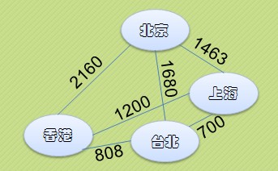
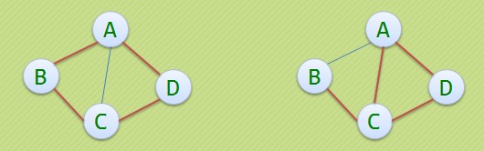

# 图（Graph）

# 1 图的定义

图（Graph）是由`顶点的有穷非空集合`和`顶点之间边的集合`组成，通常表示为：G(V,E)，其中，G表示一个图，V是图G中顶点的集合，E是图G中边的集合。

对于图的定义，我们需要明确几个注意的地方：

- 线性表中我们把数据元素叫元素，树中叫结点，在图中数据元素我们则称之为`顶点(Vertex)`。
- 线性表可以没有数据元素，称为空表，树中可以没有结点，叫做空树，而图结构在咱国内大部分的教材中强调`顶点集合V要有穷非空`。
- 线性表中，相邻的数据元素之间具有线性关系，树结构中，相邻两层的结点具有层次关系，而图结构中，任意两个顶点之间都可能有关系，`顶点之间的逻辑关系用边来表示`，`边集可以是空的`。

# 2 图的相关术语

## 2.1 无向图（Undirection Graph）

无向图中顶点之间的边（Edge）没有方向，这样的边称为无向边(Edge)，用无序偶(Vi,Vj)来表示。边的起点和终点次序并不重要。

上图G1是一个无向图，G1 = {V1, E1}，其中:

V1 = {A, B, C, D}，
E1 = {(A,B), (B,C), (C,D), (D,A), (A,C)}

## 2.2 有向图（Direction Graph）

有向图中顶点之间的所有边（Edge）都是有方向性的，这样的边称为有向边，也成为弧(Arc)，用有序偶<Vi,Vj>来表示，Vi称为弧尾，Vj称为弧头。

上图G2是一个无向图，G2 = {V2, E2}，其中:

V2 = {A, B, C, D}，
E2 = {<B,A>, <B,C>, <C,A>, <A,D>}

## 2.3 简单图 （Simple Graph）

在图结构中，若不存在顶点到其自身的边，且同一条边不重复出现，则称这样的图为简单图。

以下两个图则不属于简单图：

## 2.4 无向完全图（Undirection Complete Graph）

在无向图中，如果任意两个顶点之间都存在边，则称该图为无向完全图。含有n个顶点的无向完全图有n*(n-1)/2条边。

## 2.5 有向完全图（Direction Complete Graph）

在有向图中，如果任意两个顶点之间都存在方向互为相反的两条弧，则称该图为有向完全图。含有n个顶点的有向完全图有n*(n-1)条边。

## 2.6 稀疏图（Sparse Graph）和稠密图（Dense Graph）

这里的稀疏和稠密是模糊的概念，都是相对而言的，通常认为边或弧数小于n*logn（n是顶点的个数）的图称为稀疏图，反之称为稠密图。

## 2.7 网络（Network）

有些图的边或弧带有与它相关的数字，这种与图的边或弧相关的数叫做权（Weight）或代价（Cost），带权的图通常称为网络（Network）。

## 2.8 子图（Subgraph）

有两个图G1=(V1,E1)和G2=(V2,E2)，如果V2是V1的子集，E2是E1的子集，则称G2为G1的子图（Subgraph）。

## 2.9 连通图（Connected Graph）、联通分量（Connected Componet）

在无向图中，如果从一个顶点 A 到另一个顶点 B 有路径，则称顶点 A 和 B 是连通的（Connected）。如果图中任意两顶点都是连通的，则称该图是连通图（Connected Graph）。无向图的极大连通子图称为连通分量（Connected Componet）。

下图左侧不是连通图，右侧是连通图：

连通分量的概念包含以下4个要点：

- 子图：连通分量应该是原图的子图。
- 连通：连通分量本身应该是连通的。
- 极大定点数：连通子图含有极大顶点数，即在加入其它顶点将会导致子图不连通。
- 极大边数：具有极大顶点数的连通子图包含依附于这些顶点的所有边。

## 2.10 强连通图（Strongly Connected Graph）、强联通分量（Strongly Connected Componet）

对于有向图来说，若图中任意一对顶点 A、B，既有从 A 到 B 的路径，又有从 B 到 A 的路径。则称该有向图是强连通图（Strongly Connected Graph）。有向图的极大强连通子图称为强连通分量（Strongly Connected Componet）。

下图左侧并不是强连通图，右侧是。并且右侧是左侧的极大强连通子图，也是左侧的强连通分量。

## 2.11 生成树（Spanning Tree）

所谓连通图 G 的生成树（Spanning Tree），是 G 的包含其全部 n 个顶点的一个极小连通子图，必定包含且仅包含 G 的 n-1 条边。

如果一个有向图恰有一个顶点入度为0，其余顶点的入度均为1，则是一棵有向树。

图 G 的生成树满足以下4个条件之一：

- G 有 n-1 条边，且没有环
- G 有 n-1 条边，且是连通的
- G 中的每一对顶点有且只有一条路径相连
- G 是连通的，但删除任何一条边就会使它不连通

## 2.12 生成森林（Spanning Forest）

在非连通图中，由于每个连通分量都是一个极小连通子图，即一棵生成树可以对应一个连通分量。对应各个连通分量的个棵生成树就组成了一个图的生成森林（Spanning Forest）。对无向图而言，一个图的生成森林中树的数量就等于它的连通分量数。对于有向图说，一个强连通分量当然可以得到对应的生成树（不唯一），但是，非强连通图也可能只需用一棵生成树（有向树）与之对应。

## 2.14 邻接点、度、路径、简单路径、回路、无环路

（1）邻接点Adjacent Vertices）

如果(A,B)是无向图中任意的一条边，那么称 A 和 B 互为 邻接点（Adjacent Vertices）；如果<A,B>是有向图中任意的一条边，那么称起点 A 邻接到（Adjacent to） 终点 B，也称终点 B 邻接自（Adjacent from）起点 A。

（2）度（Degree）

顶点V的度（Degree）是和V相关联的边的数目，记为TD(V)，如下图，顶点A与B互为邻接点，边(A,B)依附于顶点A与B上，顶点A的度为3

对于有向图G=(V,E)，如果有<V1,V2>∈E，则称顶点V1邻接到顶点V2，顶点V2邻接自顶点V1。
以顶点V为头的弧的数目称为V的入度(InDegree)，记为ID(V)，以V为尾的弧的数目称为V的出度(OutDegree)，记为OD(V)，因此顶点V的度为TD(V)=ID(V)+OD(V)。

下图顶点A的入度是2，出度是1，所以顶点A的度是3。

（3）路径（Path)、简单路径、回路（Cycle，也称环）、无环图（Acyclic Graph）

无向图G=(V,E)中从顶点V1到顶点V2的路径(Path)。
下图用红线列举了从顶点B到顶点D的四种不同路径：

如果G是有向图，则路径也是有向的。
下图用红线列举顶点B到顶点D的两种路径，而顶点A到顶点B就不存在路径啦：

路径的长度是路径上的边或弧的数目。
第一个顶点到最后一个顶点相同的路径称为回路或环(Cycle)。

序列中顶点不重复出现的路径称为简单路径，除了第一个顶点和最后一个顶点之外，其余顶点不重复出现的回路，称为简单回路或简单环。
下图左侧是简单环，右侧不是简单环：

# 3 图的存储

图的存储结构相比较线性表与树来说就复杂很多。

那么我们的图，是多对多的情况，另外图上的任何一个顶点都可以被看作是第一个顶点，任一顶点的邻接点之间也不存在次序关系。

我们仔细观察以下几张图，然后深刻领悟一下：

因为任意两个顶点之间都可能存在联系，因此无法以数据元素在内存中的物理位置来表示元素之间的关系（内存物理位置是线性的，图的元素关系是平面的）。

如果用多重链表来描述倒是可以做到，但纯粹用多重链表导致的浪费是无法想像的（如果各个顶点的度数相差太大，就会造成巨大的浪费）。

## 3.1 图的存储结构（邻接矩阵）

### 3.1.1 邻接矩阵（无向图）
 
考虑到图是由顶点和边或弧两部分组成，合在一起比较困难，那就很自然地考虑到分为两个结构来分别存储。

顶点因为不区分大小、主次，所以用一个一维数组来存储是狠不错的选择。
 
而边或弧由于是顶点与顶点之间的关系，一维数组肯定就搞不定了，那我们不妨考虑用一个二维数组来存储。

于是我们的邻接矩阵方案就诞生了！
 
图的邻接矩阵(Adjacency Matrix)存储方式是用两个数组来表示图。一个一维数组存储图中顶点信息，一个二维数组(称为邻接矩阵)存储图中的边或弧的信息。

我们可以设置两个数组，顶点数组为 vertex[4] = {V0,V1,V2,V3}，边数组arc[4][4]为对称矩阵(0表示不存在顶点间的边，1表示顶点间存在边)。
 
对称矩阵：所谓对称矩阵就是n阶矩阵的元满足a[i][j]=a[j][i](0<=i,j<=n)。即从矩阵的左上角到右下角的主对角线为轴，右上角的元与左下角相对应的元全都是相等的。
 
有了这个二维数组组成的对称矩阵，我们就可以很容易地知道图中的信息：

- 要判定任意两顶点是否有边无边就非常容易了；
- 要知道某个顶点的度，其实就是这个顶点Vi在邻接矩阵中第i行(或第i列)的元素之和；
- 求顶点Vi的所有邻接点就是将矩阵中第i行元素扫描一遍，arc[i][j]为1就是邻接点咯。
 
### 3.1.2 邻接矩阵（有向图）
 
无向图的边构成了一个对称矩阵，貌似浪费了一半的空间，那如果是有向图来存放，会不会把资源都利用得很好呢？

可见顶点数组vertex[4] = {V0,V1,V2,V3}，弧数组arc[4][4]也是一个矩阵，但因为是有向图，所以这个矩阵并不对称，例如由V1到V0有弧，得到arc[1][0]=1，而V0到V1没有弧，因此arc[0][1]=0。 

另外有向图是有讲究的，要考虑入度和出度，顶点V1的入度为1，正好是第V1列的各数之和，顶点V1的出度为2，正好是第V1行的各数之和。
 
### 3.1.3 邻接矩阵（网）
 
在图的术语中，我们提到了网这个概念，事实上也就是每条边上带有权的图就叫网。

## 3.2 图的存储结构（邻接表）

邻接矩阵看上去是个不错的选择，首先是容易理解，第二是索引和编排都很舒服~

但是我们也发现，对于边数相对顶点较少的图，这种结构无疑是存在对存储空间的极大浪费。

因此我们可以考虑另外一种存储结构方式，例如把数组与链表结合一起来存储，这种方式在图结构也适用，我们称为邻接表(AdjacencyList)。

邻接表的处理方法是这样：

图中顶点用一个一维数组存储，当然，顶点也可以用单链表来存储，不过数组可以较容易地读取顶点信息，更加方便。

图中每个顶点Vi的所有邻接点构成一个线性表，由于邻接点的个数不确定，所以我们选择用单链表来存储。

### 3.2.1 邻接表（无向图）
 

### 3.2.2 邻接表（无向图）
 
若是有向图，邻接表结构也是类似的，我们先来看下把顶点当弧尾建立的邻接表，这样很容易就可以得到每个顶点的出度：（出度链表）

但也有时为了便于确定顶点的入度或以顶点为弧头的弧，我们可以建立一个有向图的逆邻接表：（入度链表）

此时我们很容易就可以算出某个顶点的入度或出度是多少，判断两顶点是否存在弧也很容易实现。

### 3.2.3 邻接表（网）
 
对于带权值的网图，可以在边表结点定义中再增加一个数据域来存储权值即可：

