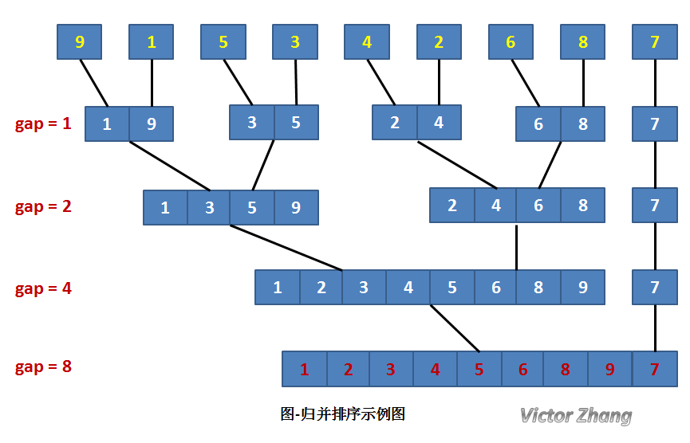
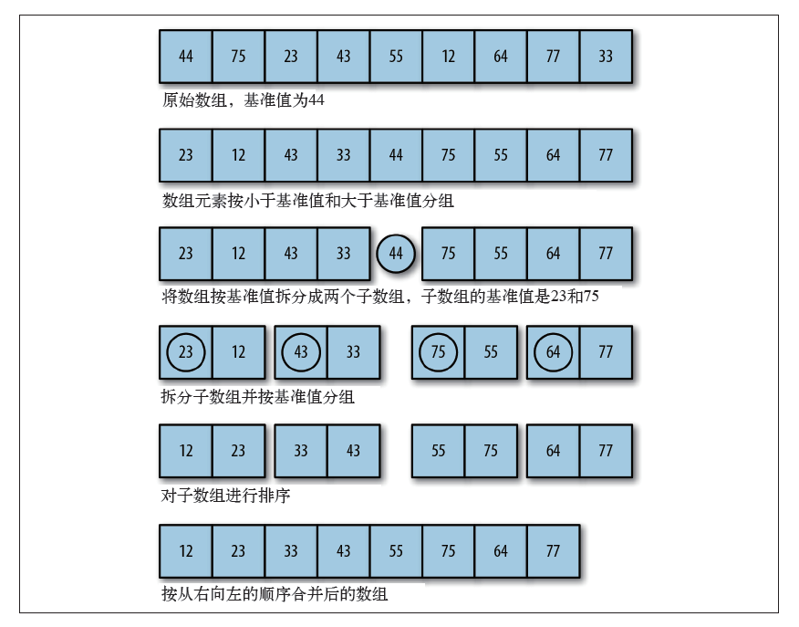

# 排序算法

# 1 基本排序算法

## 1.1 冒泡排序

基本思想：在要排序的一组数中，对当前还未排好序的范围内的全部数，自上而下对相邻的两个数依次进行比较和调整，让较大的数往下沉，较小的往上冒。即：每当两相邻的数比较后发现它们的排序与排序要求相反时，就将它们互换。

## 1.2 选择排序

基本思想：在要排序的一组数中，选出最小（或者最大）的一个数与第1个位置的数交换；然后在剩下的数当中再找最小（或者最大）的与第2个位置的数交换，依次类推，直到第n-1个元素（倒数第二个数）和第n个元素（最后一个数）比较为止。

## 1.2 插入排序

基本思想：在要排序的一组数中，选出最小（或者最大）的一个数与第1个位置的数交换；然后在剩下的数当中再找最小（或者最大）的与第2个位置的数交换，依次类推，直到第n-1个元素（倒数第二个数）和第n个元素（最后一个数）比较为止。

# 2 高级排序算法

## 2.1 希尔排序（分治思想）

基本思想：把记录按步长 gap 分组，对每组记录采用直接插入排序方法进行排序。随着步长逐渐减小，所分成的组包含的记录越来越多，当步长的值减小到 1 时，整个数据合成为一组，构成一组有序记录，则完成排序。

## 2.2 归并排序（分治思想）

基本思想：将待排序序列看成是n个有序序列，将相邻的有序表成对归并，得到n/2个有序表；将这些有序序列再次归并，得到n/4个有序序列；如此反复进行下去，最后得到一个长度为n的有序序列。

## 2.3 快速排序（分治思想）

基本思想：

- 1）选择一个基准元素,通常选择第一个元素或者最后一个元素。

- 2）通过一趟排序讲待排序的记录分割成独立的两部分，其中一部分记录的元素值均比基准元素值小。另一部分记录的 元素值比基准值大。

- 3）此时基准元素在其排好序后的正确位置。

- 4）然后分别对这两部分记录用同样的方法继续进行排序，直到整个序列有序。

