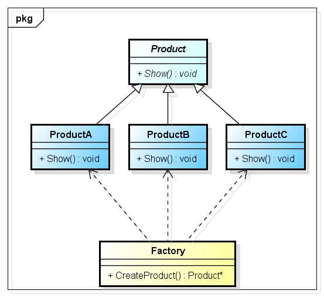
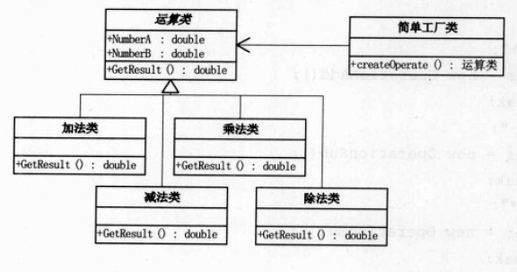

# 简单工厂模式(Simple Factory Pattern)

# 1 定义

简单工厂模式(Simple Factory Pattern)：定义一个工厂类，它可以根据参数的不同返回不同类的实例，被创建的实例通常都具有共同的父类。因为在简单工厂模式中用于创建实例的方法是`静态(static)方法`，因此简单工厂模式又被称为静态工厂方法(Static Factory Method)模式，它属于类创建型模式。

# 2 UML类图



# 3 各类职责

- `Factory（工厂角色）`：工厂角色即工厂类，它是简单工厂模式的核心，负责实现创建所有产品实例的内部逻辑；工厂类可以被外界直接调用，创建所需的产品对象；在工厂类中提供了静态的工厂方法 CreateProduct() ，它的返回类型为抽象产品类型 Product。

- `Product（抽象产品角色）`：它是工厂类所创建的所有对象的父类，封装了各种产品对象的公有方法，它的引入将提高系统的灵活性，使得在工厂类中只需定义一个通用的工厂方法，因为所有创建的具体产品对象都是其子类对象。

- `ProductA（具体产品角色）`：它是简单工厂模式的创建目标，所有被创建的对象都充当这个角色的某个具体类的实例。每一个具体产品角色都继承了抽象产品角色，需要实现在抽象产品中声明的抽象方法。

# 4 实例

## 4.1 简易计算器程序

相关类结构图：

```php
abstract class Operation {
    public $num1 = 0;
    public $num2 = 0;

    public function init($num1, $num2){
        $this->num1 = $num1;
        $this->num2 = $num2;
    }

    abstract public function getResult();
}

class OperationAdd extends Operation {
    public function getResult(){
        return $this->num1 + $this->num2;
    }
}

class OperationSub extends Operation {
    public function getResult(){
        return $this->num1 - $this->num2;
    }
}

class OperationMul extends Operation {
    public function getResult(){
        return $this->num1 * $this->num2;
    }
}

class OperationDiv extends Operation {
    public function getResult(){
        if($this->num2 === 0){
            return "除数不能为零";
        }

        return $this->num1 / $this->num2;
    }
}

class OperationFactory {
    public static $oper = null; // Operation 类型

    // 静态方法直接调用，不用实例化简单工厂类
    public static function createOperation($operate){
        switch ($operate) {
            case '+':
                self::$oper = new OperationAdd();
                break;
            case '-':
                self::$oper = new OperationSub();
                break;
            case '*':
                self::$oper = new OperationMul();
                break;
            case '/':
                self::$oper = new OperationDIv();
                break;

            default:
                # code...
                break;
        }

        return self::$oper;
    }
}


$oper = OperationFactory::createOperation('/');
$oper->init(2, 1);

var_dump($oper->getResult());
```

源码：[简易计算器程序源码](./example-001.php)
