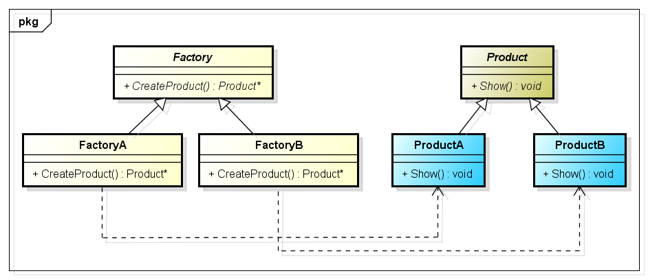

# 工厂方法模式(Factory Method Pattern)

# 1 定义

工厂方法模式(Factory Method Pattern)：定义一个用于创建对象的接口，让子类决定将哪一个类实例化。工厂方法模式让一个类的实例化延迟到其子类。工厂方法模式又简称为工厂模式(Factory Pattern)，又可称作虚拟构造器模式(Virtual Constructor Pattern)或多态工厂模式(Polymorphic Factory Pattern)。工厂方法模式是一种类创建型模式。

# 2 UML类图



# 3 各类职责

- `Product（抽象产品）`：它是定义产品的接口，是工厂方法模式所创建对象的超类型，也就是产品对象的公共父类。

- `Product*（具体产品）`：它实现了抽象产品接口，某种类型的具体产品由专门的具体工厂创建，具体工厂和具体产品之间一一对应。

- `Factory（抽象工厂）`：在抽象工厂类中，声明了工厂方法(Factory Method)，用于返回一个产品。抽象工厂是工厂方法模式的核心，所有创建对象的工厂类都必须实现该接口。

- `Factory*（具体工厂）`：它是抽象工厂类的子类，实现了抽象工厂中定义的工厂方法，并可由客户端调用，返回一个具体产品类的实例。

# 4 实例

## 4.1 日志记录器

相关类结构图：

```php
// 日志记录器接口：抽象产品 
interface Logger {
    public function writeLog();
}

// 数据库日志记录器：具体产品  
class DatabaseLogger implements Logger {
    public function writelog(){
        echo("数据库日志记录");
    }
}

// 文件日志记录器：具体产品 
class FileLogger implements Logger {
    public function writeLog(){
        echo("文件日志记录器");
    }
}

// 日志记录器工厂接口：抽象工厂  
interface LoggerFactory {  
    public function createLogger();  
} 

//  数据库日志记录器工厂类：具体工厂  
class DatabaseLoggerFactory implements LoggerFactory {  
    public function createLogger() {   
        $logger = new DatabaseLogger();   
        return $logger;  
    }     
}  
  
//  文件日志记录器工厂类：具体工厂  
class FileLoggerFactory implements LoggerFactory {  
    public function createLogger() { 
        $logger = new FileLogger(); 
        return $logger;  
    }     
}

$factory = new FileLoggerFactory(); // 可引入配置文件实现
$logger = $factory->createLogger();
$logger->writeLog();
```

源码：[日志记录器程序源码](./example-001.php)
