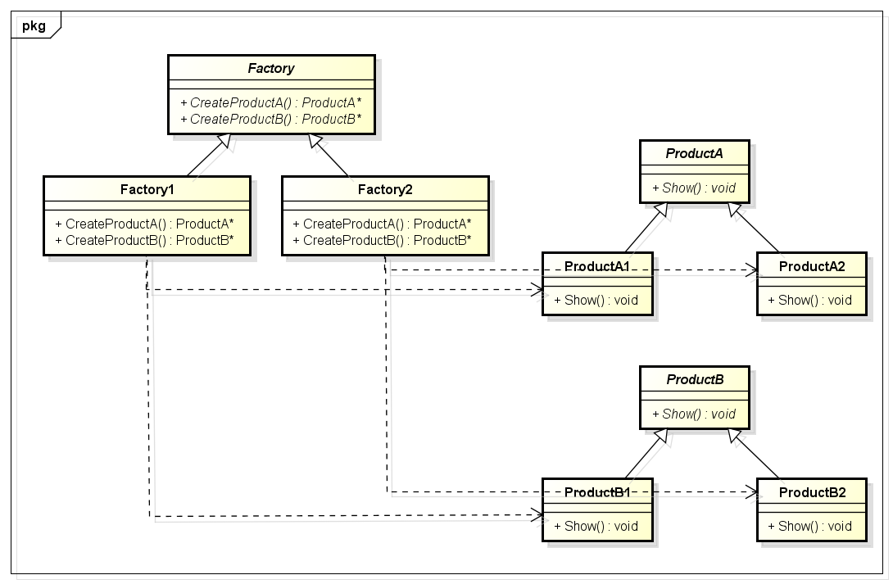

# 抽象工厂模式(Abstract Factory Pattern)

# 1 定义

抽象工厂模式(Abstract Factory Pattern)：提供一个创建一系列相关或相互依赖对象的接口，而无须指定它们具体的类。抽象工厂模式又称为Kit模式，它是一种对象创建型模式。

# 1.1 产品等级结构与产品族

在工厂方法模式中具体工厂负责生产具体的产品，每一个具体工厂对应一种具体产品，工厂方法具有唯一性，一般情况下，一个具体工厂中只有一个或者一组重载的工厂方法。但是有时候`我们希望一个工厂可以提供多个产品对象，而不是单一的产品对象，如一个电器工厂，它可以生产电视机、电冰箱、空调等多种电器，而不是只生产某一种电器`。为了更好地理解抽象工厂模式，我们先引入两个概念：

(1) 产品等级结构：产品等级结构即产品的继承结构，如一个抽象类是电视机，其子类有海尔电视机、海信电视机、TCL电视机，则抽象电视机与具体品牌的电视机之间构成了一个产品等级结构，抽象电视机是父类，而具体品牌的电视机是其子类。

(2) 产品族：在抽象工厂模式中，产品族是指由同一个工厂生产的，位于不同产品等级结构中的一组产品，如海尔电器工厂生产的海尔电视机、海尔电冰箱，海尔电视机位于电视机产品等级结构中，海尔电冰箱位于电冰箱产品等级结构中，海尔电视机、海尔电冰箱构成了一个产品族。

产品等级结构与产品族示意图如下图所示：


在上图中，**不同颜色**的多个正方形、圆形和椭圆形分别构成了三个不同的**产品等级结构**，而**相同颜色**的正方形、圆形和椭圆形构成了一个**产品族**，每一个形状对象都位于某个产品族，并属于某个产品等级结构。上图中一共有五个产品族，分属于三个不同的产品等级结构。我们只要指明一个产品所处的产品族以及它所属的等级结构，就可以唯一确定这个产品。

当系统所提供的工厂生产的具体产品并不是一个简单的对象，而是多个位于不同产品等级结构、属于不同类型的具体产品时就可以使用抽象工厂模式。`抽象工厂模式是所有形式的工厂模式中最为抽象和最具一般性的一种形式`。抽象工厂模式与工厂方法模式最大的区别在于，工厂方法模式针对的是一个产品等级结构，而抽象工厂模式需要面对多个产品等级结构，一个工厂等级结构可以负责多个不同产品等级结构中的产品对象的创建。`当一个工厂等级结构可以创建出分属于不同产品等级结构的一个产品族中的所有对象时，抽象工厂模式比工厂方法模式更为简单、更有效率`。抽象工厂模式示意图如下图所示：


在上图中，每一个具体工厂可以生产属于一个产品族的所有产品，例如生产颜色相同的正方形、圆形和椭圆形，所生产的产品又位于不同的产品等级结构中。如果使用工厂方法模式，上图所示结构需要提供15个具体工厂，而使用抽象工厂模式只需要提供5个具体工厂，极大减少了系统中类的个数。

# 2 UML类图



# 3 各类职责

- `Factory（抽象工厂）`：它声明了一组用于创建一族产品的方法，每一个方法对应一种产品。

- `Factory*（具体工厂）`：它实现了在抽象工厂中声明的创建产品的方法，生成一组具体产品，这些产品构成了一个产品族，每一个产品都位于某个产品等级结构中。

- `Product（抽象产品）`：它为每种产品声明接口，在抽象产品中声明了产品所具有的业务方法。

- `Product*（具体产品）`：它定义具体工厂生产的具体产品对象，实现抽象产品接口中声明的业务方法。

# 4 实例

## 4.1 

相关类结构图：

```php
/**
 * Springfunction 和 Summerfunction 构成一个产品族
 * function 和 SpringButton、function 和 SummerButton构成一个产品等级结构
 * 
 */
// 按钮接口：抽象产品  
interface Button {  
    public function display();  
}  

// Spring 按钮类：具体产品  
class SpringButton implements Button {  
    public function display() {  
        echo("SpringButton");  
    }  
}  

// Summer 按钮类：具体产品  
class SummerButton implements Button {  
    public function display() {  
        echo("SummerButton");  
    }     
}  

// 文本框接口：抽象产品  
interface TextField {  
    public function display();  
}  

//Spring 文本框类：具体产品  
class SpringTextField implements TextField {  
    public function display() {  
        echo("SpringTextField");  
    }  
}  

// Summer 文本框类：具体产品  
class SummerTextField implements TextField {  
    public function display() {  
        echo("SummerTextField");  
    }     
}  

// 组合框接口：抽象产品  
interface ComboBox {  
    public function display();  
}  

// Spring 组合框类：具体产品  
class SpringComboBox implements ComboBox {  
    public function display() {  
        echo("SpringComboBox");  
    }  
}  

// Summer 组合框类：具体产品  
class SummerComboBox implements ComboBox {  
    public function display() {  
        echo("SummerComboBox");  
    }     
}  
	
	/**
	 * 产品族角度考虑抽象工厂类结构
	 */
// 界面组件工厂接口：抽象工厂  
interface ComponentFactory {  
    public function createButton();  
    public function createTextField();  
    public function createComboBox();  
}  
	
// Spring 工厂：具体工厂  
class SpringComponentFactory implements ComponentFactory {  
    public function createButton() {  
        return new SpringButton();  
    }  
  
    public function createTextField() {  
        return new SpringTextField();  
    }  
  
    public function createComboBox() {  
        return new SpringComboBox();  
    }  
}  

// Summer 工厂：具体工厂  
class SummerComponentFactory implements ComponentFactory {  
    public function createButton() {  
        return new SummerButton();  
    }  
  
    public function createTextField() {  
        return new SummerTextField();  
    }  
  
    public function createComboBox() {  
        return new SummerComboBox();  
    }
}

// 创建 Sping 工厂
$ComponentFactory = new SpringComponentFactory();

// Sping 工厂生产界面组件
$springButton = $ComponentFactory->createButton();
$springTextField = $ComponentFactory->createTextField();
$springComboBox = $ComponentFactory->createComboBox();

$springButton->display();
echo("<br/>");
$springTextField->display();
echo("<br/>");
$springComboBox->display();
```

源码：[界面组件库程序源码](./example-001.php)
