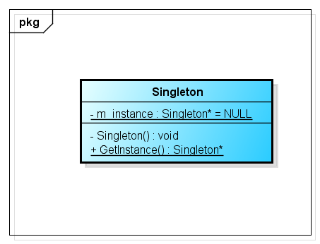

# 单例模式(Singleton Pattern)

# 1 定义

单例模式(Singleton Pattern)：确保某一个类只有一个实例，而且自行实例化并向整个系统提供这个实例，这个类称为单例类，它提供全局访问的方法。单例模式是一种对象创建型模式。

# 2 UML类图



# 3 各类职责

`Singleton（单例）`：在单例类的内部实现只生成一个实例，同时它提供一个静态的getInstance()工厂方法，让客户可以访问它的唯一实例；为了防止在外部对其实例化，将其构造函数设计为私有；在单例类内部定义了一个Singleton类型的静态对象，作为外部共享的唯一实例。

# 4 实例

## 4.1 负载均衡器程序

相关类结构图：

```php
//负载均衡器LoadBalancer：单例类，真实环境下该类将非常复杂，包括大量初始化的工作和业务方法，考虑到代码的可读性和易理解性，只列出部分与模式相关的核心代码  
class LoadBalancer {  

    // 私有静态成员变量，存储唯一实例  
    private static $instance = null;  
    // 服务器集合  
    private $servers = null;  
      
    // 私有构造函数  
    private function LoadBalancer() {  
        $this->servers = array();  
    }  
      
    // 公有静态成员方法，返回唯一实例  
    public static function getLoadBalancer() {  
        if (self::$instance === null) {  
            self::$instance = new LoadBalancer();  
        }  
        return self::$instance;  
    }  
      
    // 增加服务器  
    public function addServer($server) {  
        array_push($this->servers, $server);

        return  count($this->servers);
    }  
      
    // 删除服务器  
    public function removeServer($server) {
        $key = array_search($server, $this->servers);
        
        if($key >= 0){
            return array_splice($this->servers, $key, 1);
        }
        
        return false;  
    } 

    // 展示所有服务器
    public function showServers(){
        return $this->servers;
    }

    // 随机获取服务器  
    public function getServer() {  
        $key = rand(0, count($this->servers) - 1);  

        return $this->servers[$key];  
    } 

}  
```

源码：[负载均衡器程序源码](./example-001.php)
