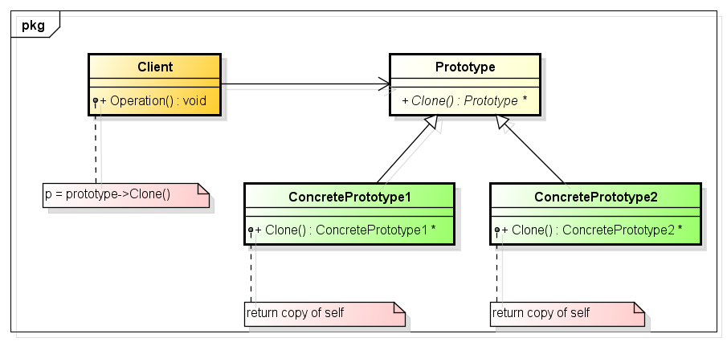

# 原型模式 Prototype Pattern

# 1 定义

原型模式(Prototype  Pattern)：使用原型实例指定创建对象的种类，并且通过拷贝这些原型创建新的对象。原型模式是一种对象创建型模式。

# 2 UML类图



# 3 各类职责

- `Prototype（抽象原型类）`：它是声明克隆方法的接口，是所有具体原型类的公共父类，可以是抽象类也可以是接口，甚至还可以是具体实现类。

- `ConcretePrototype（具体原型类）`：它实现在抽象原型类中声明的克隆方法，在克隆方法中返回自己的一个克隆对象。

- `Client（客户类）`：让一个原型对象克隆自身从而创建一个新的对象，在客户类中只需要直接实例化或通过工厂方法等方式创建一个原型对象，再通过调用该对象的克隆方法即可得到多个相同的对象。由于客户类针对抽象原型类Prototype编程，因此用户可以根据需要选择具体原型类，系统具有较好的可扩展性，增加或更换具体原型类都很方便。

# 4 实例

## 4.1 软件工程公司入职员工管理程序

```php
// 软件工程公司入职员工管理程序
abstract class Employee {

    protected $id;
    protected $name;
    protected $department;
    protected $card;

    // 雇员部门
    abstract function setDepartment();
    public function getDepartment(){
        return $this->department;
    }

    // 雇员 ID
    public function setId($id){
        $this->id = $id;
    }

    public function getId(){
        return $this->id;
    }

    // 雇员名字
    public function setName($name){
        $this->name = $name;
    }
    public function getName(){
        return $this->name;
    }
    
    // 雇员工作证
    public function setCard($card){
        $this->card = $card;
    }
    public function getCard(){
        return $this->card;
    }

    abstract function __clone();

}

// 市场营销部员工
class Marketer extends Employee {

    public function __construct(){
        $this->setDepartment();
    }

    public function setDepartment(){
        $this->department = "Marketing Department";
    }

    public function __clone() {}
}

// 软件开发部员工
class SoftwareDeveloper extends Employee {

    public function __construct(){
        $this->setDepartment();
    }

    public function setDepartment(){
        $this->department = "Sofeware Develope Department";
    }

    public function __clone() {}
}

class Client {

    private $marketer;
    private $softwareDeveloper;

    public function __construct(){

        $this->createPrototype();

        // 市场部员工
        $TessSmith = clone $this->marketer;
        $this->setEmployee($TessSmith, 101, "Tess Smith", "Marketing Department Card 001");
      
        $JacobJones = clone $this->marketer;
        $this->setEmployee($JacobJones, 102, "Jacob Jones", "Marketing Department Card 002");

        // 软件开发部员工
        $RickyRodriguez = clone $this->softwareDeveloper;
        $this->setEmployee($RickyRodriguez, 201, "Ricky Rodriguez", "Sofeware Develope Department Card 001");
        
        $OlivaiaPerez = clone $this->softwareDeveloper;
        $this->setEmployee($OlivaiaPerez, 202, "Olivaia Perez", "Sofeware Develope Department Card 002");
        
        $JohnJacson = clone $this->softwareDeveloper;
        $this->setEmployee($JohnJacson, 203, "John Jacson", "Sofeware Develope Department Card 002");


        $this->showEmployee($TessSmith);
        $this->showEmployee($JacobJones);

        $this->showEmployee($RickyRodriguez);
        $this->showEmployee($OlivaiaPerez);
        $this->showEmployee($JohnJacson);

    }

    private function createPrototype(){
        $this->marketer = new Marketer();
        $this->softwareDeveloper = new SoftwareDeveloper();
    }

    private function showEmployee(Employee $employee){

        echo $employee->getId().'<br/>';
        echo $employee->getName().'<br/>';
        echo $employee->getDepartment().'<br/>';
        echo $employee->getCard().'<hr/>';

    }

    private function setEmployee(Employee $employee, $id, $name, $card){
        $employee->setId($id);
        $employee->setName($name);
        $employee->setCard($card);
    }

}

new Client();
```

源码：[软件工程公司入职员工管理程序源码](./example-001.php)
