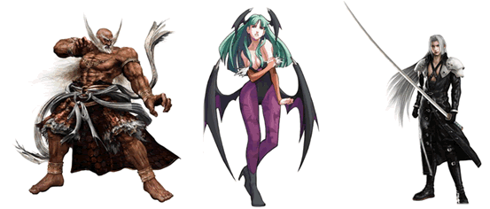
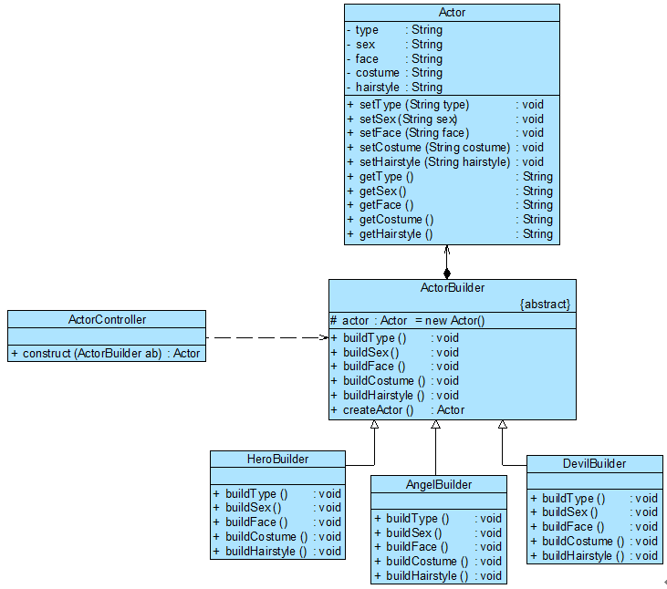

# 建造者模式(Builder Pattern)

# 1 定义

建造者模式(Builder Pattern)：将一个复杂对象的构建与它的表示分离，使得同样的构建过程可以创建不同的表示。建造者模式是一种对象创建型模式。

# 2 UML类图


# 3 各类职责

- `Builder（抽象建造者）`：它为创建一个产品Product对象的各个部件指定抽象接口，在该接口中一般声明两类方法，一类方法是buildPartX()，它们用于创建复杂对象的各个部件；另一类方法是getResult()，它们用于返回复杂对象。Builder既可以是抽象类，也可以是接口。

- `ConcreteBuilder（具体建造者）`：它实现了Builder接口，实现各个部件的具体构造和装配方法，定义并明确它所创建的复杂对象，也可以提供一个方法返回创建好的复杂产品对象。

- `Product（产品角色）`：它是被构建的复杂对象，包含多个组成部件，具体建造者创建该产品的内部表示并定义它的装配过程。

- `Director（指挥者）`：指挥者又称为导演类，它负责安排复杂对象的建造次序，指挥者与抽象建造者之间存在关联关系，可以在其construct()建造方法中调用建造者对象的部件构造与装配方法，完成复杂对象的建造。客户端一般只需要与指挥者进行交互，在客户端确定具体建造者的类型，并实例化具体建造者对象（也可以通过配置文件和反射机制），然后通过指挥者类的构造函数或者Setter方法将该对象传入指挥者类中。

# 4 实例

## 4.1 

几种不同的游戏角色造型：

游戏角色创建结构图：

```php
//Actor角色类：复杂产品，考虑到代码的可读性，只列出部分成员属性，且成员属性的类型均为String，真实情况下，有些成员属性的类型需自定义
class Actor {

	private  $type; 		//角色类型
	private  $sex; 			//性别
	private  $face; 		//脸型
	private  $costume; 		//服装
	private  $hairstyle; 	//发型

	public function setType($type) {
	     $this->type  = $type;
	}

	public function setSex($sex) {
	     $this->sex  = $sex;
	}

	public function setFace($face) {
	     $this->face = $face;
	}

	public function setCostume($costume) {
	      $this->costume = $costume;
	}

	public function setHairstyle($hairstyle) {
	      $this->hairstyle  = $hairstyle;
	}

	public function getType() {
	    return $this->type;
	}

	public function getSex() {
	    return $this->sex;
	}

	public  function getFace() {
	    return $this->face;
	}

	public function getCostume() {
	    return $this->costume;
	}

	public function getHairstyle() {
	    return $this->hairstyle;
	}

}

// 角色建造器：抽象建造者
abstract class ActorBuilder {

	protected $actor = null;

	public function __construct(){ // 抽象类子类方法的访问控制必须和父类中一样（或者更为宽松）
		$this->actor = new Actor();
	}

	public abstract function buildType();
	public abstract function buildSex();
	public abstract function buildFace();
	public abstract function buildCostume();
	public abstract function buildHairstyle();
 
    // 工厂方法，返回一个完整的游戏角色对象
    public function createActor(){
        return $this->actor;
    }
}

//英雄角色建造器：具体建造者
class HeroBuilder extends ActorBuilder {

    public  function buildType(){
        $this->actor->setType("英雄");
    }

    public  function buildSex(){
        $this->actor->setSex("男");
    }

    public  function buildFace(){
        $this->actor->setFace("英俊");
    }

    public  function buildCostume(){
        $this->actor->setCostume("盔甲");
    }

   	public function buildHairstyle(){
        $this->actor->setHairstyle("飘逸");
   	}    
}

// 天使角色建造器：具体建造者
class AngelBuilder extends ActorBuilder {

    public function buildType(){
        $this->actor->setType("天使");
    }

    public function buildSex(){
        $this->actor->setSex("女");
    }

    public function buildFace(){
        $this->actor->setFace("漂亮");
    }

    public function buildCostume(){
        $this->actor->setCostume("白裙");
    }

    public function buildHairstyle(){
        $this->actor->setHairstyle("披肩长发");
    }

}

// 恶魔角色建造器：具体建造者
class DevilBuilder extends ActorBuilder {

    public function buildType(){
        $this->actor->setType("恶魔");
    }

    public function buildSex(){
        $this->actor->setSex("妖");
    }

    public function buildFace(){
        $this->actor->setFace("丑陋");
    }

    public function buildCostume(){
        $this->actor->setCostume("黑衣");
    }

    public function buildHairstyle(){
        $this->actor->setHairstyle("光头");
    }  

}

class ActorController {

	private $actorBuilder = null;

	// 逐步构建复杂产品对象
   	public function __construct(ActorBuilder $actorBuilder){

   		$this->actorBuilder = $actorBuilder;

        $this->actorBuilder->buildType();
        $this->actorBuilder->buildSex();
        $this->actorBuilder->buildFace();
        $this->actorBuilder->buildCostume();
        $this->actorBuilder->buildHairstyle();

    }

    public function getActor(){

    	$actor = $this->actorBuilder->createActor();
        return $actor;

    }

}
```

源码：[游戏角色设计程序源码](./example-001.php)
