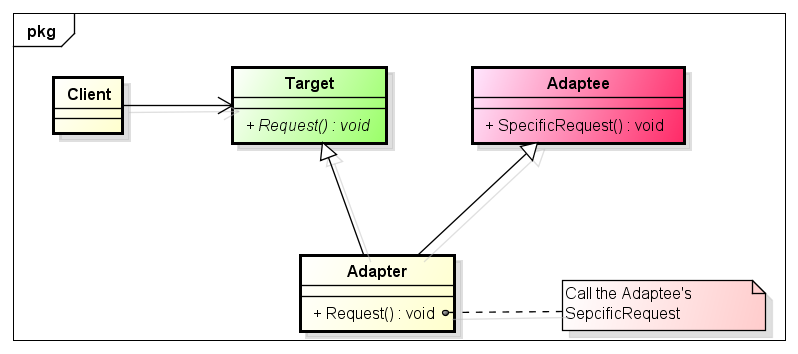
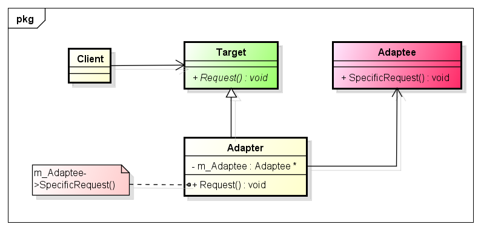
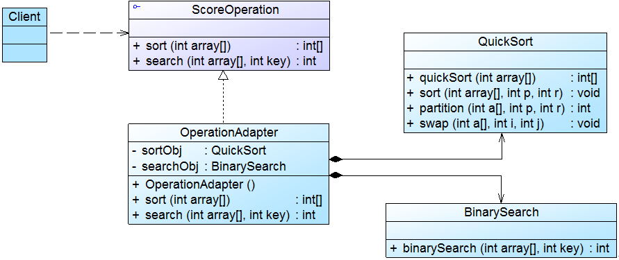

# 适配器模式(Adapter Pattern)

# 1 定义

适配器模式(Adapter Pattern)：将一个接口转换成客户希望的另一个接口，使接口不兼容的那些类可以一起工作，其别名为包装器(Wrapper)。适配器模式既可以作为类结构型模式，也可以作为对象结构型模式。

# 2 UML 类图

# 2.1 类式配器 UML 类图



# 2.2 对象式配器 UML 类图



注：`类适配器模式和对象适配器模式最大的区别在于适配器和适配者之间的关系不同，对象适配器模式中适配器和适配者之间是关联关系，而类适配器模式中适配器和适配者是继承关系。`

# 3 各类职责

- `Target（目标抽象类）`：目标抽象类定义客户所需接口，可以是一个抽象类或接口，也可以是具体类。

- `Adapter（适配器类）`：适配器可以调用另一个接口，作为一个转换器，对Adaptee和Target进行适配，适配器类是适配器模式的核心，在对象适配器中，它通过继承Target并关联一个Adaptee对象使二者产生联系。

- `Adaptee（适配者类）`：适配者即被适配的角色，它定义了一个已经存在的接口，这个接口需要适配，适配者类一般是一个具体类，包含了客户希望使用的业务方法，在某些情况下可能没有适配者类的源代码。

# 4 实例

## 4.1 没有源码的算法库的适配器模式（对象适配器）解决方案

相关类结构图：

```php
// 抽象成绩操作类：目标接口  
interface ScoreOperation {  
    public function sort($array); 			//成绩排序  
    public function search($array, $key); 	//成绩查找  
}  

//快速排序类：适配者  
class QuickSort {  

    public function sort($array) {  
        // 判断数组是否需要继续进行排序
	    $length = count($array);
	    if($length <= 1) {
	        return $array;
	    }
	
	    // 选择第一个元素为标尺
	    $base_num = $array[0];
	    // 初始化两个数组；遍历除了标尺外的所有元素，按照大小关系放入两个数组内
	    $left_array = array();	// 小于标尺的
	    $right_array = array();	// 大于标尺的

	    for($i=1; $i<$length; $i+=1) {
	        if($array[$i] < $base_num){
	            $left_array[] = $array[$i]; // 放入左边数组
	        }else{
	            $right_array[] = $array[$i]; // 放入右边数组
	        }
	    }
	    
	    // 再分别对左边、右边的数组进行相同的排序处理方式；递归调用这个函数,并记录结果
	    $left_array = $this->sort($left_array);
	    $right_array = $this->sort($right_array);
	    
	    //合并左边、标尺、右边
	    return array_merge($left_array, array($base_num), $right_array);
    }  
 
}  

// 二分查找类：适配者  
class BinarySearch { // 有序数据查找目标值
    public function search($array, $target){
        $min = 0;
        $max = count($array) - 1;
        
        while($min<=$max){
            $middle = floor( ($min + $max) / 2);
            // 找到元素
            if($array[$middle] == $target){
            	return $middle;
            } 
            // 元素比目标大,查找左部
            if($array[$middle] > $target) {
            	$max = $middle - 1;
            }
            // 元素比目标小,查找右部
            if($array[$middle] < $target) {
            	$min = $middle + 1;
            }
        }
        
        // 查找失败
        return false;
    }
}  

//	操作适配器：适配器  
class OperationAdapter implements ScoreOperation {  

    private $quickSort; 		// 定义适配者QuickSort对象  
    private $binarySearch; 	// 定义适配者BinarySearch对象  
  
    public function __construct() {  
        $this->quickSort = new QuickSort();  
        $this->binarySearch = new BinarySearch();  
    }  
  
    public function sort($array) {    
		return $this->quickSort->sort($array); // 调用适配者类 sort 的排序方法  
	}  
  
    public function search($array, $target) {    
		return $this->binarySearch->search($array, $target); // 调用适配者类 search 的查找方法  
	}  

}  
```

源码：[没有源码的算法库的适配器模式解决方案源码](./example-001.php)
