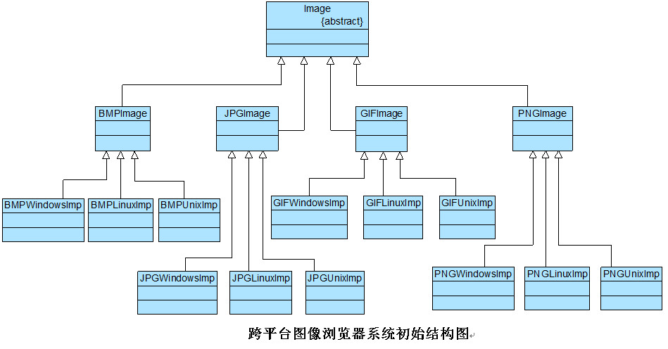
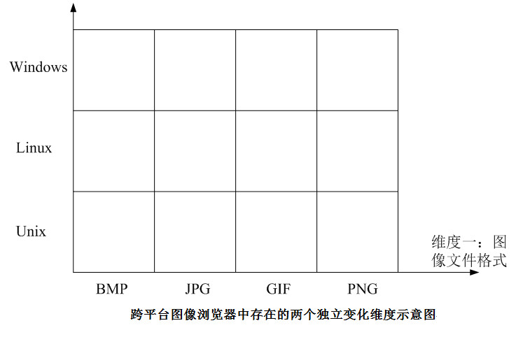
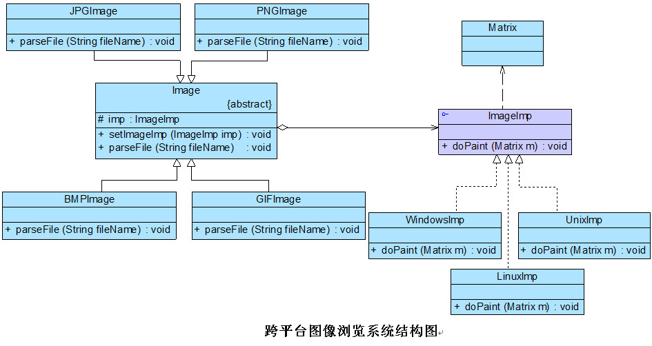
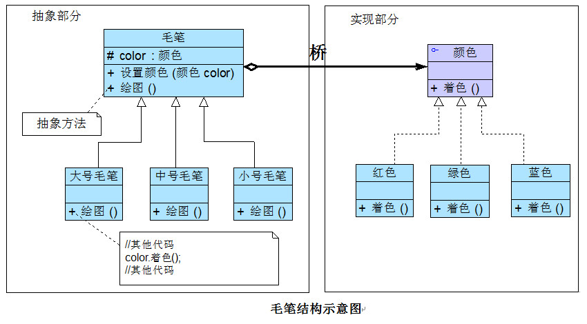

# 桥接模式(Bridge Pattern)

# 1 定义

桥接模式(Bridge Pattern)：将抽象部分与它的实现部分分离，使它们都可以独立地变化。它是一种对象结构型模式，又称为柄体(Handle and Body)模式或接口(Interface)模式。

## 1.1 典型例子：跨平台图像浏览系统 

某软件公司欲开发一个跨平台图像浏览系统，要求该系统能够显示BMP、JPG、GIF、PNG等多种格式的文件，并且能够在Windows、Linux、Unix等多个操作系统上运行。系统首先将各种格式的文件解析为像素矩阵(Matrix)，然后将像素矩阵显示在屏幕上，在不同的操作系统中可以调用不同的绘制函数来绘制像素矩阵。系统需具有较好的扩展性以支持新的文件格式和操作系统。

初始设计方案：



通过分析可得知，该系统存在两个独立变化的维度：图像文件格式和操作系统，如下图所示：



# 2 UML类图


# 3 各类职责

- `Abstraction（抽象类）`：用于定义抽象类的接口，它一般是抽象类而不是接口，其中定义了一个Implementor（实现类接口）类型的对象并可以维护该对象，它与Implementor之间具有关联关系，它既可以包含抽象业务方法，也可以包含具体业务方法。

- `RefinedAbstraction（扩充抽象类）`：扩充由Abstraction定义的接口，通常情况下它不再是抽象类而是具体类，它实现了在Abstraction中声明的抽象业务方法，在RefinedAbstraction中可以调用在Implementor中定义的业务方法。

- `Implementor（实现类接口）`：定义实现类的接口，这个接口不一定要与Abstraction的接口完全一致，事实上这两个接口可以完全不同，一般而言，Implementor接口仅提供基本操作，而Abstraction定义的接口可能会做更多更复杂的操作。Implementor接口对这些基本操作进行了声明，而具体实现交给其子类。通过关联关系，在Abstraction中不仅拥有自己的方法，还可以调用到Implementor中定义的方法，使用关联关系来替代继承关系。

- `ConcreteImplementor（具体实现类）`：具体实现Implementor接口，在不同的ConcreteImplementor中提供基本操作的不同实现，在程序运行时，ConcreteImplementor对象将替换其父类对象，提供给抽象类具体的业务操作方法。

# 4 实例

## 4.1 跨平台图像浏览系统

相关类结构图：

```php
// 像素矩阵类：辅助类，各种格式的文件最终都被转化为像素矩阵，不同的操作系统提供不同的方式显示像素矩阵 
class Matrix {  
    // 此处代码省略  
}  

// 抽象操作系统实现类：实现类接口  
interface ImageImp {  
    public function doPaint($matrix);  //显示像素矩阵m  
}   

// Windows操作系统实现类：具体实现类  
class WindowsImp implements ImageImp {  
    public function doPaint($matrix) {  
        // 调用Windows系统的绘制函数绘制像素矩阵  
        echo("在Windows操作系统中显示图像：");  
    }  
}  

// Linux操作系统实现类：具体实现类  
class LinuxImp implements ImageImp {  
    public function doPaint($matrix) {  
        // 调用Linux系统的绘制函数绘制像素矩阵  
        echo("在Linux操作系统中显示图像：");  
    }  
}  

// Unix操作系统实现类：具体实现类  
class UnixImp implements ImageImp {  
    public function doPaint($matrix) {  
        // 调用Unix系统的绘制函数绘制像素矩阵  
        echo("在Unix操作系统中显示图像：");  
    }  
}  

	//抽象图像类：抽象类  
abstract class Image {  
    protected $imageImp = null;  
  
    public function __construct($mageImp) {  
        $this->imageImp = $mageImp;  
    }   
  
    public abstract function parseFile($fileName);  
} 

// JPG格式图像：扩充抽象类  
class JPGImage extends Image {  
    public function parseFile($fileName) {  
        // 模拟解析JPG文件并获得一个像素矩阵对象m;  
        $matrix = new Matrix();   
        $this->imageImp->doPaint($matrix);  
        echo($fileName."，格式为JPG。");  
    }  
}  
  
// PNG格式图像：扩充抽象类  
class PNGImage extends Image {  
    public function parseFile($fileName) {  
        // 模拟解析PNG文件并获得一个像素矩阵对象m;  
        $matrix = new Matrix();   
        $this->imageImp->doPaint($matrix);  
        echo($fileName."，格式为PNG。");  
    }  
}  
  
// BMP格式图像：扩充抽象类  
class BMPImage extends Image {  
    public function parseFile($fileName) {  
        // 模拟解析BMP文件并获得一个像素矩阵对象m;  
        $matrix = new Matrix();   
        $this->imageImp->doPaint($matrix);  
        echo($fileName."，格式为BMP。");  
    }  
}  
  
// GIF格式图像：扩充抽象类  
class GIFImage extends Image {  
    public function parseFile($fileName) {  
        // 模拟解析GIF文件并获得一个像素矩阵对象m;  
        $matrix = new Matrix();   
        $this->imageImp->doPaint($matrix);
        echo($fileName."，格式为GIF。");  
    }  
} 
```

源码：[跨平台图像浏览系统源码](./example-001.php)

## 4.2  毛笔与颜料桥接实例

相关类结构图：