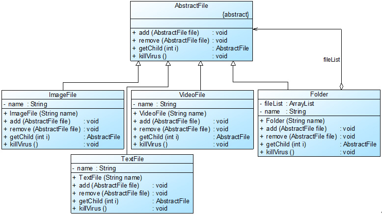

# 组合模式(Composite Pattern)

# 1 定义

组合模式(Composite Pattern)：组合多个对象形成树形结构以表示具有“整体—部分”关系的层次结构。组合模式对单个对象（即叶子对象）和组合对象（即容器对象）的使用具有一致性，组合模式又可以称为“整体—部分”(Part-Whole)模式，它是一种对象结构型模式。

# 2 UML类图


# 3 各类职责

- `Component（抽象构件）`：它可以是接口或抽象类，为叶子构件和容器构件对象声明接口，在该角色中可以包含所有子类共有行为的声明和实现。在抽象构件中定义了访问及管理它的子构件的方法，如增加子构件、删除子构件、获取子构件等。

- `Leaf（叶子构件）`：它在组合结构中表示叶子节点对象，叶子节点没有子节点，它实现了在抽象构件中定义的行为。对于那些访问及管理子构件的方法，可以通过异常等方式进行处理。

- `Composite（容器构件）`：它在组合结构中表示容器节点对象，容器节点包含子节点，其子节点可以是叶子节点，也可以是容器节点，它提供一个集合用于存储子节点，实现了在抽象构件中定义的行为，包括那些访问及管理子构件的方法，在其业务方法中可以递归调用其子节点的业务方法。

# 4 实例

## 4.1 杀毒软件的框架结构

相关类结构图：

```php
// 抽象文件类：抽象构件  
abstract class AbstractFile {  
    public abstract function add($file);  
    public abstract function remove($file);  
    public abstract function getChild($i);  
    public abstract function killVirus();  
}  
  
// 图像文件类：叶子构件  
class ImageFile extends AbstractFile {  
    private $name;  
      
    public function __construct($name) {  
        $this->name = $name;  
    }  
      
    public function add($file) {  
       echo("对不起，不支持该方法！"."<br/>");  
    }  
      
    public function remove($file) {  
        echo("对不起，不支持该方法！"."<br/>");  
    }  
      
    public function getChild($i) {  
        echo("对不起，不支持该方法！"."<br/>");  
        return null;  
    }  
      
    public function killVirus() {  
        // 模拟杀毒  
        echo("--------对图像文件'".$this->name."'进行杀毒"."<br/>");  
    }  
}  
  
// 文本文件类：叶子构件  
class TextFile extends AbstractFile {  
    private $name;  
      
    public function __construct($name) {  
        $this->name = $name;  
    }  
      
    public function add($file) {  
       echo("对不起，不支持该方法！"."<br/>");  
    }  
      
    public function remove($file) {  
        echo("对不起，不支持该方法！"."<br/>");  
    }  
      
    public function getChild($i) {  
        echo("对不起，不支持该方法！"."<br/>");  
        return null;  
    }  
      
    public function killVirus() {  
        // 模拟杀毒  
        echo("--------对文本文件'".$this->name."'进行杀毒"."<br/>");  
    }  
}  
  
// 视频文件类：叶子构件  
class VideoFile extends AbstractFile {  
    private $name;  
      
    public function __construct($name) {  
        $this->name = $name;  
    }  
      
    public function add($file) {  
       echo("对不起，不支持该方法！"."<br/>");  
    }  
      
    public function remove($file) {  
        echo("对不起，不支持该方法！"."<br/>");  
    }  
      
    public function getChild($i) {  
        echo("对不起，不支持该方法！"."<br/>");  
        return null;  
    }  
      
    public function killVirus() {  
        // 模拟杀毒  
        echo("--------对视频文件'".$this->name."'进行杀毒"."<br/>");  
    }  
}  
  
// 文件夹类：容器构件  
class Folder extends AbstractFile {  
    // 定义集合fileList，用于存储AbstractFile类型的成员  
    private $files = null;  
    private $name;  
          
    public function __construct($name) {  
        $this->name = $name;
        $this->files = array();
    }  
      
    public function add($file) {  
       array_push($this->files, $file);    
    }  
      
    public function remove($file) { 
        $index = array_search($file, $this->files);
        if($index > -1){
            return array_splice($this->files, $index, 1);  
        }
        return false;
    }  
      
    public function getChild($i) {  
        return $this->files[$i];  
    }  
      
    public function killVirus() {  
        echo("****对文件夹'".$this->name."'进行杀毒"."<br/>");  // 模拟杀毒  
        // 递归调用成员构件的killVirus()方法 
        $len = count($this->files); 
        for($i=0; $i<$len; $i++) {  
            $this->files[$i]->killVirus();  
        }  
    }  
}  
```

源码：[杀毒软件的框架结构源码](./example-001.php)
