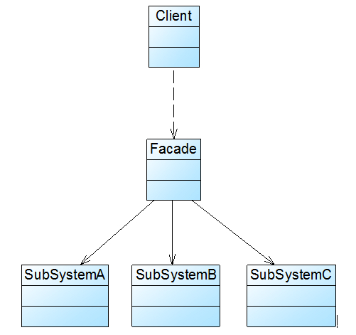
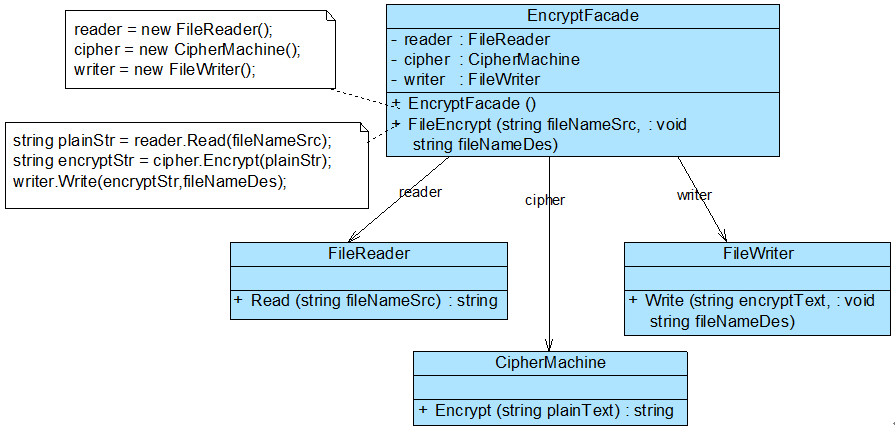

# 外观模式(Facade Pattern)

# 1 定义

外观模式：为子系统中的一组接口提供一个统一的入口。外观模式定义了一个高层接口，这个接口使得这一子系统更加容易使用。

Facade Pattern: Provide a unified interface to a set of interfaces in a subsystem. Facade defines a higher-level interface that makes the subsystem easier to use.

# 2 UML类图



# 3 各类职责

-  `Facade（外观角色）`：在客户端可以调用它的方法，在外观角色中可以知道相关的（一个或者多个）子系统的功能和责任；在正常情况下，它将所有从客户端发来的请求委派到相应的子系统去，传递给相应的子系统对象处理。

- `SubSystem（子系统角色）`：在软件系统中可以有一个或者多个子系统角色，每一个子系统可以不是一个单独的类，而是一个类的集合，它实现子系统的功能；每一个子系统都可以被客户端直接调用，或者被外观角色调用，它处理由外观类传过来的请求；子系统并不知道外观的存在，对于子系统而言，外观角色仅仅是另外一个客户端而已。

# 4 实例

## 4.1 文件加密模块

某软件公司欲开发一个可应用于多个软件的文件加密模块，该模块可以对文件中的数据进行加密并将加密之后的数据存储在一个新文件中，具体的流程包括三个部分，分别是读取源文件、加密、保存加密之后的文件，其中，读取文件和保存文件使用流来实现，加密操作通过求模运算实现。这三个操作相对独立，为了实现代码的独立重用，让设计更符合单一职责原则，这三个操作的业务代码封装在三个不同的类中。

相关类结构图：

```php
  class FileReader {  
    public function read(){
      echo("读取文件，获取明文："."<br>");
    }
  }

  class CipherMachine {
    public function encrypt(){
      echo("数据加密，将明文转换为密文："."<br>");
    }
  }

  class FileWriter {
    public function write(){
      echo("保存密文，写入文件。"."<br>");
    }
  }

  class EncryptFacade {  
    // 维持对其他对象的引用  
    private $reader = null;  
    private $cipher = null;  
    private $writer = null;  

    public function __construct() {  
      $this->reader = new FileReader();  
      $this->cipher = new CipherMachine();  
      $this->writer = new FileWriter();  
    }  

    // 调用其他对象的业务方法  
    public function FileEncrypt() {  
      $this->reader->read();  
      $this->cipher->encrypt();  
      $this->writer->Write();  
    }  
  } 

  $facde = new EncryptFacade();
  $facde->FileEncrypt(); 
```

源码：[文件加密模块](./example-001.php)
