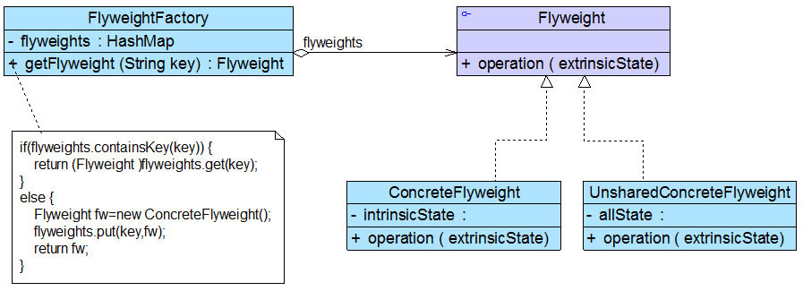
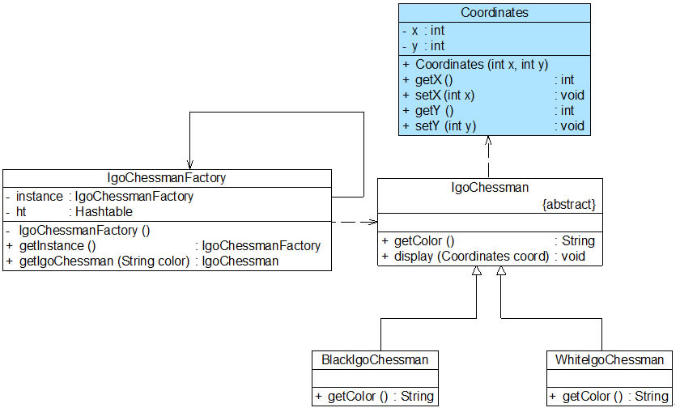

# 享元模式(Flyweight Pattern)

# 1 定义

享元模式(Flyweight Pattern)：运用共享技术有效地支持大量细粒度对象的复用。系统只使用少量的对象，而这些对象都很相似，状态变化很小，可以实现对象的多次复用。由于享元模式要求能够共享的对象必须是细粒度对象，因此它又称为轻量级模式，它是一种对象结构型模式。

享元模式以共享的方式高效地支持大量细粒度对象的重用，享元对象能做到共享的关键是区分了`内部状态(Intrinsic State)`和`外部状态(Extrinsic State)`。

- (1) 内部状态是存储在享元对象内部并且不会随环境改变而改变的状态，内部状态可以共享。

- (2) 外部状态是随环境改变而改变的、不可以共享的状态。享元对象的外部状态通常由客户端保存，并在享元对象被创建之后，需要使用的时候再传入到享元对象内部。一个外部状态与另一个外部状态之间是相互独立的。

# 2 UML类图



# 3 各类职责

- `Flyweight（抽象享元类）`：通常是一个接口或抽象类，在抽象享元类中声明了具体享元类公共的方法，这些方法可以向外界提供享元对象的内部数据（内部状态），同时也可以通过这些方法来设置外部数据（外部状态）。

- `ConcreteFlyweight（具体享元类）`：它实现了抽象享元类，其实例称为享元对象；在具体享元类中为内部状态提供了存储空间。通常我们可以结合单例模式来设计具体享元类，为每一个具体享元类提供唯一的享元对象。

- `UnsharedConcreteFlyweight（非共享具体享元类）`：并不是所有的抽象享元类的子类都需要被共享，不能被共享的子类可设计为非共享具体享元类；当需要一个非共享具体享元类的对象时可以直接通过实例化创建。

- `FlyweightFactory（享元工厂类）`：享元工厂类用于创建并管理享元对象，它针对抽象享元类编程，将各种类型的具体享元对象存储在一个享元池中，享元池一般设计为一个存储“键值对”的集合（也可以是其他类型的集合），可以结合工厂模式进行设计；当用户请求一个具体享元对象时，享元工厂提供一个存储在享元池中已创建的实例或者创建一个新的实例（如果不存在的话），返回新创建的实例并将其存储在享元池中。

# 4 实例

## 4.1 围棋棋子的享元模式解决方案

相关类结构图：

```php
// 围棋棋子类：抽象享元类  
abstract class IgoChessman {  
    public abstract function getColor();  
  
    public function display($coordinates) {  
        echo("棋子颜色：".$this->getColor()."棋子位置：(".$coordinates->getX().",".$coordinates->getY().")");    
    }  
}  
  
// 黑色棋子类：具体享元类  
class BlackIgoChessman extends IgoChessman {  
    public function getColor() {  
        return "黑色";  
    }     
}  
  
// 白色棋子类：具体享元类  
class WhiteIgoChessman extends IgoChessman {  
    public function getColor() {  
        return "白色";  
    }  
}  

// 坐标类：外部状态类  
class Coordinates {  
    private $x;  
    private $y;  
      
    public function __construct($x, $y) {  
        $this->x = $x;  
        $this->y = $y;  
    }  
      
    public function getX() {  
        return $this->x;  
    }  
      
    public function setX($x) {  
        $this->x = $x;  
    }  
    
    public function getY() {  
        return $this->y;  
    }  
      
    public function setY($y) {  
        $this->y = $y;  
    }  
}
  
// 围棋棋子工厂类：享元工厂类，使用单例模式进行设计  
class IgoChessmanFactory {  
    private static $instance = null;  
    private static $array = array(); // 使用数组来存储享元对象，充当享元池  
      
    private function __construct() {  
        $black = new BlackIgoChessman();  
        self::$array["black"] = $black;  
        $white = new WhiteIgoChessman();  
        self::$array["white"] = $white;
    }  
      
    // 返回享元工厂类的唯一实例  
    public static function getInstance() { 
    	self::$instance = new IgoChessmanFactory();
        return self::$instance;  
    }  
      
    // 通过key来获取存储在Hashtable中的享元对象  
    public static function getIgoChessman($color) { 
        return self::$array[$color];    
    }  
}  
```

源码：[围棋棋子的享元模式解决方案](./example-001.php)
