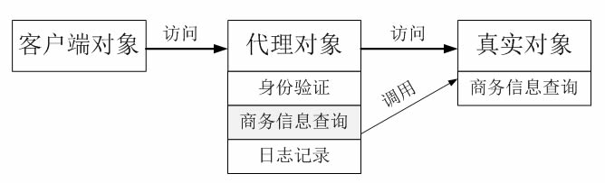

# 代理模式(Proxy Pattern)

# 1 定义

代理模式：给某一个对象提供一个代理或占位符，并由代理对象来控制对原对象的访问。

Proxy Pattern: Provide a surrogate or placeholder for another object to control access to it.

(1) `远程代理(Remote Proxy)`：为一个位于不同的地址空间的对象提供一个本地的代理对象，这个不同的地址空间可以是在同一台主机中，也可是在另一台主机中，远程代理又称为大使(Ambassador)。

(2) `虚拟代理(Virtual Proxy)`：如果需要创建一个资源消耗较大的对象，先创建一个消耗相对较小的对象来表示，真实对象只在需要时才会被真正创建。

(3) `保护代理(Protect Proxy)`：控制对一个对象的访问，可以给不同的用户提供不同级别的使用权限。

(4) `缓冲代理(Cache Proxy)`：为某一个目标操作的结果提供临时的存储空间，以便多个客户端可以共享这些结果。

(5) `智能引用代理(Smart Reference Proxy)`：当一个对象被引用时，提供一些额外的操作，例如将对象被调用的次数记录下来等。

# 2 UML类图


# 3 各类职责

- `Subject（抽象主题角色）`：它声明了真实主题和代理主题的共同接口，这样一来在任何使用真实主题的地方都可以使用代理主题，客户端通常需要针对抽象主题角色进行编程。

- `Proxy（代理主题角色）`：它包含了对真实主题的引用，从而可以在任何时候操作真实主题对象；在代理主题角色中提供一个与真实主题角色相同的接口，以便在任何时候都可以替代真实主题；代理主题角色还可以控制对真实主题的使用，负责在需要的时候创建和删除真实主题对象，并对真实主题对象的使用加以约束。通常，在代理主题角色中，客户端在调用所引用的真实主题操作之前或之后还需要执行其他操作，而不仅仅是单纯调用真实主题对象中的操作。

- `RealSubject（真实主题角色）`：它定义了代理角色所代表的真实对象，在真实主题角色中实现了真实的业务操作，客户端可以通过代理主题角色间接调用真实主题角色中定义的操作。

# 4 实例

## 4.1 商务信息查询系统设计方案

业务逻辑图：

相关类结构图：

```php
// AccessValidator：身份验证类，业务类，它提供方法Validate()来实现身份验证。
class AccessValidator {  
    // 模拟实现登录验证  
    public function Validate($id) {  
        if ($id) {  
            echo("登录成功！");  
            return true;  
        }else {  
            echo("登录失败！");  
            return false;  
        }  
    }  
}  

// Logger：日志记录类，业务类，它提供方法Log()来保存日志。
class Logger {  
    // 模拟实现日志记录  
    public function Log($id) {  
        echo("更新数据库，".$id."查询次数加1！");  
    }  
}  

// Searcher：抽象查询类，充当抽象主题角色，它声明了DoSearch()方法。
interface Searcher  {  
    public function DoSearch($id, $key);  
}  

// RealSearcher：具体查询类，充当真实主题角色，它实现查询功能，提供方法DoSearch()来查询信息。
class RealSearcher implements Searcher  {  
    // 模拟查询商务信息  
    public function DoSearch($id, $key) {  
       echo($id."查询".$key."有关的商务信息！");  
        return "返回具体内容";  
    }  
}  

// ProxySearcher：代理查询类，充当代理主题角色，它是查询代理，维持了对RealSearcher对象、AccessValidator对象和Logger对象的引用。
class ProxySearcher implements Searcher {  
    private $searcher = null; // 维持一个对真实主题的引用  
    private $validator = null;  
    private $logger = null;  
    
    public function __construct(){
        $this->searcher = new RealSearcher();
    }
    public function DoSearch($id, $key)  {  
        // 如果身份验证成功，则执行查询  
        if ($this->Validate($id)){  
            $result = $this->searcher->DoSearch($id, $key); // 调用真实主题对象的查询方法  
            $this->Log($id); // 记录查询日志  
            return $result; // 返回查询结果  
        }else{  
            return null;  
        }  
    }  

    // 创建访问验证对象并调用其Validate()方法实现身份验证  
    public function Validate($id){  
        $this->validator = new AccessValidator();  
        return $this->validator->Validate($id);  
    }  

    // 创建日志记录对象并调用其Log()方法实现日志记录  
    public function Log($id){  
        $this->logger = new Logger();  
        $this->logger->Log($id);  
    }  
}  
```

源码：[商务信息查询系统设计方案源码](./example-001.php)
