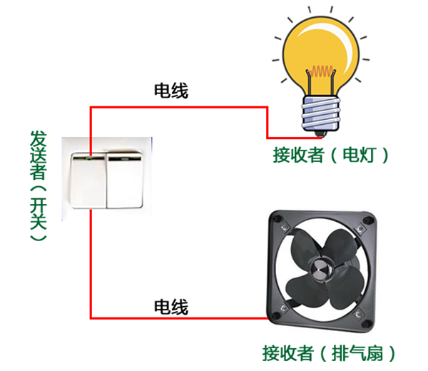

# 命令模式（Command Pattern）

# 1 请求发送者与接收者解耦

装修新房的最后几道工序之一是安装插座和开关，通过开关可以控制一些电器的打开和关闭，例如电灯或者排气扇。在购买开关时，我们并不知道它将来到底用于控制什么电器，也就是说，开关与电灯、排气扇并无直接关系，一个开关在安装之后可能用来控制电灯，也可能用来控制排气扇或者其他电器设备。开关与电器之间通过电线建立连接，如果开关打开，则电线通电，电器工作；反之，开关关闭，电线断电，电器停止工作。相同的开关可以通过不同的电线来控制不同的电器，如下图所示：



在上图中，我们可以将开关理解成一个请求的发送者，用户通过它来发送一个“开灯”请求，而电灯是“开灯”请求的最终接收者和处理者，在图中，开关和电灯之间并不存在直接耦合关系，它们通过电线连接在一起，使用不同的电线可以连接不同的请求接收者，只需更换一根电线，相同的发送者（开关）即可对应不同的接收者（电器）。

在软件开发中也存在很多与开关和电器类似的请求发送者和接收者对象，例如一个按钮，它可能是一个“关闭窗口”请求的发送者，而按钮点击事件处理类则是该请求的接收者。为了降低系统的耦合度，将请求的发送者和接收者解耦，我们可以使用一种被称之为命令模式的设计模式来设计系统，在命令模式中，发送者与接收者之间引入了新的命令对象（类似图1中的电线），将发送者的请求封装在命令对象中，再通过命令对象来调用接收者的方法。本章我们将学习用于将请求发送者和接收者解耦的命令模式。

# 2 命令模式概述

在软件开发中，我们经常需要向某些对象发送请求（调用其中的某个或某些方法），但是并不知道请求的接收者是谁，也不知道被请求的操作是哪个，此时，我们特别希望能够以一种松耦合的方式来设计软件，使得请求发送者与请求接收者能够消除彼此之间的耦合，让对象之间的调用关系更加灵活，可以灵活地指定请求接收者以及被请求的操作。命令模式为此类问题提供了一个较为完美的解决方案。

**命令模式可以将请求发送者和接收者完全解耦，发送者与接收者之间没有直接引用关系，发送请求的对象只需要知道如何发送请求，而不必知道如何完成请求。**

命令模式定义如下：

>命令模式(Command Pattern)：将一个请求封装为一个对象，从而让我们可用不同的请求对客户进行参数化；对请求排队或者记录请求日志，以及支持可撤销的操作。命令模式是一种对象行为型模式，其别名为动作(Action)模式或事务(Transaction)模式。

命令模式的核心在于引入了命令类，通过命令类来降低发送者和接收者的耦合度，请求发送者只需指定一个命令对象，再通过命令对象来调用请求接收者的处理方法，其结构如下图所示：


- `Command（抽象命令类）`：抽象命令类一般是一个抽象类或接口，在其中声明了用于执行请求的execute()等方法，通过这些方法可以调用请求接收者的相关操作。

- ConcreteCommand（具体命令类）：具体命令类是抽象命令类的子类，实现了在抽象命令类中声明的方法，它对应具体的接收者对象，将接收者对象的动作绑定其中。在实现execute()方法时，将调用接收者对象的相关操作(Action)。

- Invoker（调用者）：调用者即请求发送者，它通过命令对象来执行请求。一个调用者并不需要在设计时确定其接收者，因此它只与抽象命令类之间存在关联关系。在程序运行时可以将一个具体命令对象注入其中，再调用具体命令对象的execute()方法，从而实现间接调用请求接收者的相关操作。

- Receiver（接收者）：接收者执行与请求相关的操作，它具体实现对请求的业务处理。

`命令模式的本质是对请求进行封装，一个请求对应于一个命令，将发出命令的责任和执行命令的责任分割开。`每一个命令都是一个操作：请求的一方发出请求要求执行一个操作；接收的一方收到请求，并执行相应的操作。`命令模式允许请求的一方和接收的一方独立开来，使得请求的一方不必知道接收请求的一方的接口，更不必知道请求如何被接收、操作是否被执行、何时被执行，以及是怎么被执行的。`

`命令模式的关键在于引入了抽象命令类，请求发送者针对抽象命令类编程，只有实现了抽象命令类的具体命令才与请求接收者相关联。`在最简单的抽象命令类中只包含了一个抽象的execute()方法，每个具体命令类将一个Receiver类型的对象作为一个实例变量进行存储，从而具体指定一个请求的接收者，不同的具体命令类提供了execute()方法的不同实现，并调用不同接收者的请求处理方法。

# 3 命令队列的实现

有时候我们需要`将多个请求排队，当一个请求发送者发送一个请求时，将不止一个请求接收者产生响应，这些请求接收者将逐个执行业务方法，完成对请求的处理`。此时，我们可以通过`命令队列`来实现。

命令队列的实现方法有多种形式，其中最常用、灵活性最好的一种方式是增加一个CommandQueue类，由该类来负责存储多个命令对象，而不同的命令对象可以对应不同的请求接收者。

命令队列与我们常说的“批处理”有点类似。批处理，顾名思义，可以对一组对象（命令）进行批量处理，当一个发送者发送请求后，将有一系列接收者对请求作出响应，命令队列可以用于设计批处理应用程序，如果请求接收者的接收次序没有严格的先后次序，我们还可以使用多线程技术来并发调用命令对象的execute()方法，从而提高程序的执行效率。

# 4 宏命令

`宏命令(Macro Command)又称为组合命令，它是组合模式和命令模式联用的产物`。宏命令是一个具体命令类，它拥有一个集合属性，在该集合中包含了对其他命令对象的引用。`通常宏命令不直接与请求接收者交互，而是通过它的成员来调用接收者的方法`。当调用宏命令的execute()方法时，将递归调用它所包含的每个成员命令的execute()方法，一个宏命令的成员可以是简单命令，还可以继续是宏命令。`执行一个宏命令将触发多个具体命令的执行，从而实现对命令的批处理`。其结构如下图所示：


# 5 命令模式总结

命令模式是一种使用频率非常高的设计模式，它可以将请求发送者与接收者解耦，请求发送者通过命令对象来间接引用请求接收者，使得系统具有更好的灵活性和可扩展性。在基于GUI的软件开发，无论是在电脑桌面应用还是在移动应用中，命令模式都得到了广泛的应用。

## 5.1 主要优点

- 1、`降低系统的耦合度`。由于请求者与接收者之间不存在直接引用，因此请求者与接收者之间实现完全解耦，相同的请求者可以对应不同的接收者，同样，相同的接收者也可以供不同的请求者使用，两者之间具有良好的独立性。

- 2、`新的命令可以很容易地加入到系统中`。由于增加新的具体命令类不会影响到其他类，因此增加新的具体命令类很容易，无须修改原有系统源代码，甚至客户类代码，满足“开闭原则”的要求。

- 3、`可以比较容易地设计一个命令队列或宏命令（组合命令）`

- 4、`为请求的撤销(Undo)和恢复(Redo)操作提供了一种设计和实现方案。`

## 5.2 主要缺点

`使用命令模式可能会导致某些系统有过多的具体命令类`。因为针对每一个对请求接收者的调用操作都需要设计一个具体命令类，因此在某些系统中可能需要提供大量的具体命令类，这将影响命令模式的使用。

## 5.3 适用场景

- 1、系统需要将请求调用者和请求接收者解耦，使得调用者和接收者不直接交互。请求调用者无须知道接收者的存在，也无须知道接收者是谁，接收者也无须关心何时被调用。

- 2、系统需要在不同的时间指定请求、将请求排队和执行请求。一个命令对象和请求的初始调用者可以有不同的生命期，换言之，最初的请求发出者可能已经不在了，而命令对象本身仍然是活动的，可以通过该命令对象去调用请求接收者，而无须关心请求调用者的存在性，可以通过请求日志文件等机制来具体实现。

- 3、系统需要支持命令的撤销(Undo)操作和恢复(Redo)操作。

- 4、系统需要将一组操作组合在一起形成宏命令。

# 6 实例

## 6.1 自定义功能键的命令模式解决方案

相关类结构图：

```php
// 功能键设置窗口类  
class FBSettingWindow {  
    private $title; // 窗口标题  
    // 定义一个 Array 来存储所有功能键  
    private $functionButtons = null;  
      
    public function __construct($title) {  
        $this->title = $title;  
        $this->functionButtons = array();
    }  
      
    public function setTitle($title) {  
        $this->title = $title;  
    }  
      
    public function getTitle() {  
        return $this->title;  
    }  
      
    public function addFunctionButton($fb) {  
        array_push($this->functionButtons, $fb);
    }  
      
    public function removeFunctionButton($fb) {  
       $index = array_search($fb);  
       array_splice($this->functionButtons, $index, 1);
    }  
      
    //显示窗口及功能键  
    public function display() {  
        echo("显示窗口：" . $this->title . "<br/>");  
        echo("显示功能键：" . "<br/>");  
        foreach($this->functionButtons as $value){
        	echo($value->getName() . "<br/>");
        }
        echo("------------------------------" . "<br/>");  
    }     
}  
  
// 功能键类：请求发送者  
class FunctionButton {  
    private $name; // 功能键名称  
    private $command; // 维持一个抽象命令对象的引用  
      
    public function __construct($name) {  
        $this->name = $name;  
    }  
      
    public function getName() {  
        return $this->name;  
    }  
      
    // 为功能键注入命令  
    public function setCommand($command) {  
        $this->command = $command;  
    }  
      
    // 发送请求的方法  
    public function onClick() {  
        echo("点击功能键：");  
        $this->command->execute();  
    }  
}  
  
// 抽象命令类  
abstract class Command {  
    public abstract function execute();  
}  
  
// 帮助命令类：具体命令类  
class HelpCommand extends Command {  
    private $helpHandler = null; // 维持对请求接收者的引用  
      
    public function __construct() {  
        $this->helpHandler = new HelpHandler();  
    }  
      
    // 命令执行方法，将调用请求接收者的业务方法  
    public function execute() {  
        $this->helpHandler->display();  
    }  
}  
  
// 最小化命令类：具体命令类  
class MinimizeCommand extends Command {  
    private $windowHanlder = null; // 维持对请求接收者的引用  
      
    public function __construct() {  
        $this->windowHanlder = new WindowHanlder();  
    }  
      
	// 命令执行方法，将调用请求接收者的业务方法  
    public function execute() {  
        $this->windowHanlder->minimize();  
    }  
}  
  
// 窗口处理类：请求接收者  
class WindowHanlder {  
    public function minimize() {  
        echo("将窗口最小化至托盘！" . "<br/>");  
    }  
}  
  
// 帮助文档处理类：请求接收者  
class HelpHandler {  
    public function display() {  
        echo("显示帮助文档！" . "<br/>");  
    }  
}  
```

源码：[自定义功能键的命令模式解决方案源码](./example-001.php)
