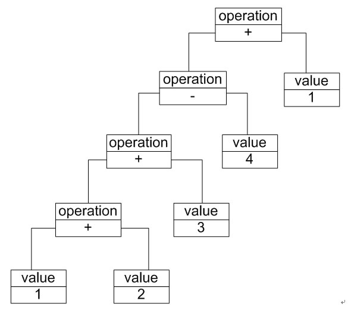

# 解释器模式（Interpreter Pattern）

# 1 文法规则和抽象语法树

如何表示一个语言的文法规则以及如何构造一棵抽象语法树。例如加法/减法解释器，每一个输入表达式，例如“1 + 2 + 3 – 4 + 1”，都包含了三个语言单位，可以使用如下文法规则来定义：

```
expression 	::= value | operation
operation 	::= expression '+' expression | expression '-'  expression
value 		::= an integer //一个整数值
```

该文法规则包含三条语句，`第一条表示表达式的组成方式`，其中 value 和 operation 是后面两个`语言单位的定义`，每一条语句所定义的字符串如 operation 和 value 称为语言构造成分或语言单位，符号 “::=” 表示“定义为”的意思，其左边的语言单位通过右边来进行说明和定义，`语言单位对应终结符表达式和非终结符表达式`。如本规则中的 operation 是非终结符表达式，它的组成元素仍然可以是表达式，可以进一步分解，而value是终结符表达式，它的组成元素是最基本的语言单位，不能再进行分解。

`在文法规则定义中可以使用一些符号来表示不同的含义，如使用“|”表示或，使用“{”和“}”表示组合，使用“*”表示出现0次或多次等，其中使用频率最高的符号是表示“或”关系的“|”，如文法规则“boolValue ::= 0 | 1”表示终结符表达式boolValue的取值可以为0或者1。`

除了使用文法规则来定义一个语言，在解释器模式中还可以通过一种称之为`抽象语法树(Abstract Syntax Tree, AST)`的图形方式来直观地表示语言的构成，每一棵抽象语法树对应一个语言实例，如加法/减法表达式语言中的语句“1+ 2 + 3 – 4 + 1”，可以通过下图所示抽象语法树来表示：



在该抽象语法树中，可以通过终结符表达式value和非终结符表达式operation组成复杂的语句，每个文法规则的语言实例都可以表示为一个抽象语法树，即每一条具体的语句都可以用类似图18-2所示的抽象语法树来表示，在图中终结符表达式类的实例作为树的叶子节点，而非终结符表达式类的实例作为非叶子节点，它们可以将终结符表达式类的实例以及包含终结符和非终结符实例的子表达式作为其子节点。抽象语法树描述了如何构成一个复杂的句子，通过对抽象语法树的分析，可以识别出语言中的终结符类和非终结符类。


# 2 解释器模式概述

>解释器模式(Interpreter Pattern)：定义一个语言的文法，并且建立一个解释器来解释该语言中的句子，这里的“语言”是指使用规定格式和语法的代码。解释器模式是一种类行为型模式。


- `AbstractExpression（抽象表达式）`：在抽象表达式中声明了抽象的解释操作，它是所有终结符表达式和非终结符表达式的公共父类。

- `TerminalExpression（终结符表达式）`：终结符表达式是抽象表达式的子类，它实现了与文法中的终结符相关联的解释操作，在句子中的每一个终结符都是该类的一个实例。通常在一个解释器模式中只有少数几个终结符表达式类，它们的实例可以通过非终结符表达式组成较为复杂的句子。

- `NonterminalExpression（非终结符表达式）`：非终结符表达式也是抽象表达式的子类，它实现了文法中非终结符的解释操作，由于在非终结符表达式中可以包含终结符表达式，也可以继续包含非终结符表达式，因此其解释操作一般通过递归的方式来完成。

- `Context（环境类）`：环境类又称为上下文类，它用于存储解释器之外的一些全局信息，通常它临时存储了需要解释的语句。

# 3 解释器模式总结

解释器模式为自定义语言的设计和实现提供了一种解决方案，它用于定义一组文法规则并通过这组文法规则来解释语言中的句子。虽然解释器模式的使用频率不是特别高，但是它在正则表达式、XML文档解释等领域还是得到了广泛使用。与解释器模式类似，目前还诞生了很多基于抽象语法树的源代码处理工具，例如Eclipse中的Eclipse AST，它可以用于表示Java语言的语法结构，用户可以通过扩展其功能，创建自己的文法规则。

## 3.1 

- 1、易于改变和扩展文法。由于在解释器模式中使用类来表示语言的文法规则，因此可以通过继承等机制来改变或扩展文法。

- 2、每一条文法规则都可以表示为一个类，因此可以方便地实现一个简单的语言。

- 3、实现文法较为容易。在抽象语法树中每一个表达式节点类的实现方式都是相似的，这些类的代码编写都不会特别复杂，还可以通过一些工具自动生成节点类代码。

- 4、增加新的解释表达式较为方便。如果用户需要增加新的解释表达式只需要对应增加一个新的终结符表达式或非终结符表达式类，原有表达式类代码无须修改，符合“开闭原则”。

## 3.2 主要缺点

- 1、对于复杂文法难以维护。在解释器模式中，每一条规则至少需要定义一个类，因此如果一个语言包含太多文法规则，类的个数将会急剧增加，导致系统难以管理和维护，此时可以考虑使用语法分析程序等方式来取代解释器模式。

- 2、执行效率较低。由于在解释器模式中使用了大量的循环和递归调用，因此在解释较为复杂的句子时其速度很慢，而且代码的调试过程也比较麻烦。

## 3.3 

- 1、 可以将一个需要解释执行的语言中的句子表示为一个抽象语法树。

- 2、 一些重复出现的问题可以用一种简单的语言来进行表达。

- 3、 一个语言的文法较为简单。

- 4、执行效率不是关键问题。【注：高效的解释器通常不是通过直接解释抽象语法树来实现的，而是需要将它们转换成其他形式，使用解释器模式的执行效率并不高。】

# 4 实例

## 4.1 机器人控制程序的解释器模式解决方案

器人控制指令“down run 10 and left move 20”对应的抽象语法树如下图所示：


相关类结构图：

```php
// 注：本实例对机器人控制指令的输出结果进行模拟，将英文指令翻译为中文指令
// 实际情况是调用不同的控制程序进行机器人的控制，包括对移动方向、方式和距离的控制等  
  
// 抽象表达式  
abstract class AbstractNode {  
    public abstract function interpret();  
}  
  
// And解释：非终结符表达式  
class AndNode extends AbstractNode {  
    private $leftAbstractNode = null; // And的左表达式  
    private $rightAbstractNode = null; // And的右表达式  
  
    public function __construct($leftAbstractNode, $rightAbstractNode) {  
        $this->leftAbstractNode = $leftAbstractNode;  
        $this->rightAbstractNode = $rightAbstractNode;  
    }  
      
    // And表达式解释操作  
    public function interpret() {  
        return $this->leftAbstractNode->interpret() . "再" . $this->rightAbstractNode->interpret();  
    }  
}  
  
// 简单句子解释：非终结符表达式  
class SentenceNode extends AbstractNode {  
    private $direction = null;  
    private $action = null;  
    private $distance = null;  
  
    public function __construct($direction, $action, $distance) {  
        $this->direction = $direction;  
        $this->action = $action;  
        $this->distance = $distance;  
    }  
      
    // 简单句子的解释操作  
    public function interpret() {  
        return $this->direction->interpret() . $this->action->interpret() . $this->distance->interpret();  
    }     
}  
  
// 方向解释：终结符表达式  
class DirectionNode extends AbstractNode {  
    private $direction;  
      
    public function __construct($direction) {  
        $this->direction = $direction;  
    }  
      
    // 方向表达式的解释操作  
    public function interpret() {
    	$type = strtolower($this->direction);
    	switch($type){
    		case "up" : return "向上"; 
    		case "down" : return "向下";
    		case "left" : return "向左";
    		case "right" : return "向右"; 
    		default : return "无效指令"; 
    	}
    }  
}  
  
// 动作解释：终结符表达式  
class ActionNode extends AbstractNode {  
    private $action;  
      
    public function __construct($action) {  
        $this->action = $action;  
    }  
      
    //动作（移动方式）表达式的解释操作  
    public function interpret() {  
    	$type = strtolower($this->action);
    	switch($type){
    		case "move" : return "移动";   
    		case "run" : return "快速移动";
    		default : return "无效指令"; 
    	}
    }  
}  
  
// 距离解释：终结符表达式  
class DistanceNode extends AbstractNode {  
    private $distance;  
      
    public function __construct($distance) {  
        $this->distance = $distance;  
    }  
      
 	// 距离表达式的解释操作  
    public function interpret() {  
        return $this->distance;  
    }     
}  
  
// 指令处理类：工具类  
class InstructionHandler {    
    private $abstractNode = null;  
      
    public function handle($instruction) {  
        $leftAbstractNode = null;
        $rightAbstractNode = null; 

        $direction = null; 
        $action = null; 
        $distance = null;  

        $stack = array(); // 模拟一个栈对象用于存储抽象语法树  
        $wordsArray = split(" ", $instruction); // 以空格分隔指令字符串 
        dump($wordsArray);

        for ($i=0, $len=count($wordsArray)-2; $i<$len; $i+=1) {  
			// 本实例采用栈的方式来处理指令，如果遇到“and”，
			// 则将其后的三个单词作为三个终结符表达式连成一个简单句子SentenceNode作为“and”的右表达式，
			// 而将从栈顶弹出的表达式作为“and”的左表达式，
			// 最后将新的“and”表达式压入栈中。
			$temp = strtolower($wordsArray[$i]);                 
			if ($temp === "and") {  
                $leftAbstractNode = Array_pop($stack); // 弹出栈顶表达式作为左表达式  
                
                $word1 = $wordsArray[++$i];  
                $direction = new DirectionNode($word1); 

                $word2 = $wordsArray[++$i];  
                $action = new ActionNode($word2);  

                $word3 = $wordsArray[++$i]; 
                $distance = new DistanceNode($word3); 

                $rightAbstractNode = new SentenceNode($direction, $action, $distance); // 右表达式  
                Array_push($stack, New AndNode($leftAbstractNode, $rightAbstractNode)); // 将新表达式压入栈中   
            } else { // 如果是从头开始进行解释，则将前三个单词组成一个简单句子SentenceNode并将该句子压入栈中   
                $word1 = $wordsArray[$i];  
                $direction = new DirectionNode($word1); 

                $word2 = $wordsArray[++$i];  
                $action = new ActionNode($word2);  

                $word3 = $wordsArray[++$i];
                $distance = new DistanceNode($word3); 

                $leftAbstractNode = new SentenceNode($direction, $action, $distance);  
                Array_push($stack, $leftAbstractNode); // 将新表达式压入栈中  
            }  
        }  
        $this->abstractNode = array_pop($stack); // 将全部表达式从栈中弹出  
    }  
      
    public function output() {  
        $result = $this->abstractNode->interpret(); // 解释表达式  
        return $result;  
    }  
} 
```

源码：[机器人控制程序的解释器模式解决方案源码](./example-001.php)
