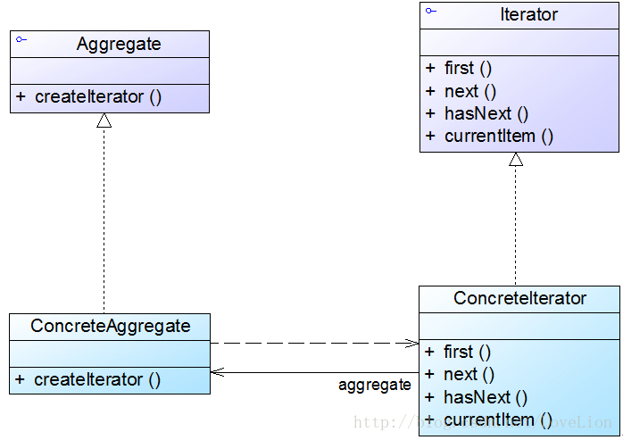

# 迭代器模式（Iterator Pattern）

# 1 迭代器模式概述

在软件开发中，我们经常需要使用聚合对象来存储一系列数据。聚合对象拥有两个职责：一是存储数据；二是遍历数据。从依赖性来看，前者是聚合对象的基本职责；而后者既是可变化的，又是可分离的。因此，可以将遍历数据的行为从聚合对象中分离出来，封装在一个被称之为“迭代器”的对象中，由迭代器来提供遍历聚合对象内部数据的行为，这将简化聚合对象的设计，更符合“单一职责原则”的要求。

迭代器模式定义如下：

>迭代器模式(Iterator Pattern)：提供一种方法来访问聚合对象，而不用暴露这个对象的内部表示，其别名为游标(Cursor)。迭代器模式是一种对象行为型模式。

在迭代器模式结构中包含聚合和迭代器两个层次结构，考虑到系统的灵活性和可扩展性，在迭代器模式中应用了工厂方法模式，其模式结构如下图所示：



- `Iterator（抽象迭代器）`：它定义了访问和遍历元素的接口，声明了用于遍历数据元素的方法，例如：用于获取第一个元素的first()方法，用于访问下一个元素的next()方法，用于判断是否还有下一个元素的hasNext()方法，用于获取当前元素的currentItem()方法等，在具体迭代器中将实现这些方法。

- `ConcreteIterator（具体迭代器）`：它实现了抽象迭代器接口，完成对聚合对象的遍历，同时在具体迭代器中通过游标来记录在聚合对象中所处的当前位置，在具体实现时，游标通常是一个表示位置的非负整数。

- `Aggregate（抽象聚合类）`：它用于存储和管理元素对象，声明一个createIterator()方法用于创建一个迭代器对象，充当抽象迭代器工厂角色。

- `ConcreteAggregate（具体聚合类）`：它实现了在抽象聚合类中声明的createIterator()方法，该方法返回一个与该具体聚合类对应的具体迭代器ConcreteIterator实例。

# 4 实例

## 4.1 销售管理系统中数据的遍历的迭代器模式解决方案

相关类结构图：

```php
// 抽象聚合类  
abstract class AbstractObjectList {  
    protected $objects = null;  
  
    public function __construct($products) {  
        $this->objects = $products;  
    }  
      
    public function addObject($obj) {  
        array_push($this->objects, $obj);  
    }  
      
    public function removeObject($obj) {  
        $index = array_search($obj);
        array_splice($this->objects, $index, 1);
    }  
      
    public function getObjects() {  
        return $this->objects;  
    }  
      
    // 声明创建迭代器对象的抽象工厂方法  
    public abstract function createIterator();  
}  
  
// 商品数据类：具体聚合类  
class ProductList extends AbstractObjectList {  

    public function __construct($products) {  
        parent::__construct($products);
    }  
      
    // 实现创建迭代器对象的具体工厂方法  
    public function createIterator() {  
        return new ProductIterator($this);  
    }  
}   
  
//抽象迭代器  
interface AbstractIterator {  

    public function next(); //移至下一个元素  
    public function isLast(); //判断是否为最后一个元素  
    public function previous(); //移至上一个元素  
    public function isFirst(); //判断是否为第一个元素  
    public function getNextItem(); //获取下一个元素  
    public function getPreviousItem(); //获取上一个元素  
}  
  
//商品迭代器：具体迭代器  
class ProductIterator implements AbstractIterator {  
    private $productList = null;  
    private $products = null;  
    private $cursor1; //定义一个游标，用于记录正向遍历的位置  
    private $cursor2; //定义一个游标，用于记录逆向遍历的位置  
      
    public function __construct($list) {  
        $this->productList = $list;  
        $this->products = $list->getObjects(); //获取集合对象  
        $this->cursor1 = 0; //设置正向遍历游标的初始值  
        $this->cursor2 = count($this->products) - 1; //设置逆向遍历游标的初始值  
    }  
      
    public function next() {  
        if($this->cursor1 < count($this->products)) {  
            $this->cursor1++;  
        }  
    }  
      
    public function isLast() {  
        return $this->cursor1 === count($this->products);  
    }  
      
    public function previous() {  
        if ($this->cursor2 > -1) {  
            $this->cursor2--;  
        }  
    }  
      
    public function isFirst() {  
        return ($this->cursor2 === -1);  
    }  
      
    public function getNextItem() {  
        return $this->products[$this->cursor1];  
    }   
          
    public function getPreviousItem() {  
        return $this->products[$this->cursor2];   
    }     
} 
```

源码：[销售管理系统数据遍历结构图源码](./example-001.php)
